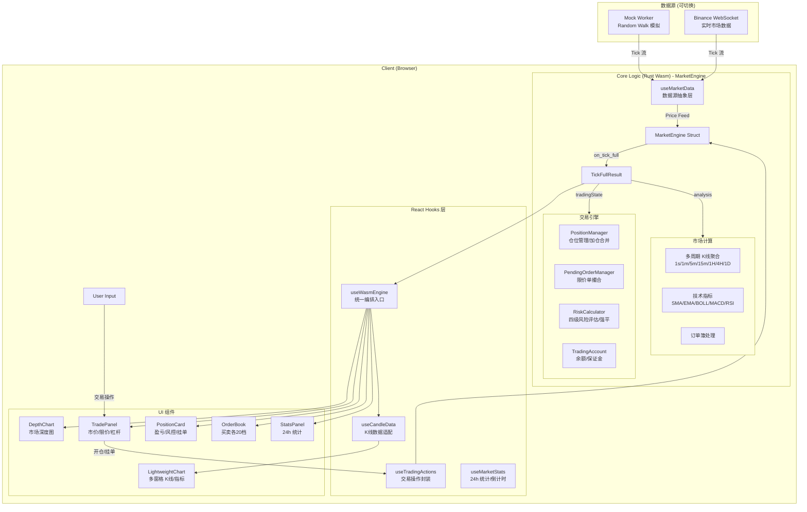

# RustQuantLab Architecture Design

> **Document Status**: Active
> **Last Updated**: 2026-02-07
> **Core Pattern**: Stateful Trading Engine (Rust/Wasm) + Managed UI (React) + TradingView Lightweight Charts

## 1. 核心设计理念 (Core Philosophy)

RustQuantLab 旨在构建下一代高性能 Web 交易终端。我们的核心设计原则是 **"Client-Side Heavy Computing"（重客户端计算）**。

我们认为，现代浏览器的算力（配合 WebAssembly）已被严重低估。通过将计算权下放，我们实现了：
1.  **Zero-Latency Interaction**: 指标切换与数据分析在本地毫秒级完成，无需网络请求。
2.  **Server Offloading**: 服务端仅作为单一可信数据源（Source of Truth）和撮合中心，不再承担繁重的展示逻辑计算。
3.  **High FPS Rendering**: 通过 TradingView Lightweight Charts (Canvas) 实现 60FPS 的丝滑 K 线渲染体验。

## 2. 技术栈架构 (Tech Stack & Roles)

系统由四个紧密协作但职责分离的层级组成：

| 层级 | 技术选型 | 角色 | 核心职责 |
| :--- | :--- | :--- | :--- |
| **Logic Layer** | **Rust (Wasm)** | **The Brain** | **[有状态交易引擎]** 多周期 K 线聚合 (1s→1D)、技术指标计算 (SMA/EMA/BOLL/MACD/RSI)、仓位管理（多/空/加仓）、限价单撮合、风控强平 (四级风险评估)、逐仓/全仓保证金。通过 `on_tick_full` 合并调用减少跨边界开销。 |
| **Data Layer** | **Mock Worker + Binance WS** | **The Source** | **[数据源抽象]** `useMarketData` 统一 Mock (Random Walk) 和 Binance WebSocket 双数据源接口，支持一键切换与历史 K 线加载。 |
| **UI Layer** | **React + Tailwind + Zustand** | **The Manager** | **[状态管理型]** 负责组件生命周期、布局响应 (Mobile→4K)、用户交互事件分发、数据源切换过渡、骨架屏反馈。不处理金融数学运算。 |
| **View Layer** | **Lightweight Charts 5.1** | **The Painter** | **[视觉渲染型]** TradingView 官方图表引擎。多窗格 K 线 + 副图指标 (VOL/MACD/RSI)、深度图 (DepthChart)、订单簿。Canvas 直渲避免 DOM Diff。 |

## 3. 数据流设计 (Data Flow)

系统采用**双向数据流**设计：市场数据单向流入，交易指令双向交互。



### 3.1 核心交互流程

1. **市价开仓**: `User Click` → `useTradingActions.placeOrder()` → `Rust: open_position(request)` → `State Update` → `handleEngineEvents()` → `Toast + UI Refresh`
2. **限价挂单**: `User Submit` → `Rust: open_position({orderType: 'limit', price})` → `保证金冻结` → `LimitOrderCreated Event` → 等待价格触及自动撮合
3. **平仓**: `User Click` → `Rust: close_position()` → `PnL Realized` → `PositionClosed Event` → `Balance Updated`
4. **强制平仓**: `Price Tick` → `Rust: 风控检查` → `保证金率 ≤ 维持保证金率` → `自动强平` → `Liquidated Event` → `警告 Toast`
5. **实时盈亏**: `Price Tick` → `Rust: on_tick_full()` → `{ analysis, candles, tradingState }` 单次返回 → `React setState` → `UI Display`

### 3.2 `on_tick_full` 合并优化

传统方式需要 3 次 Wasm 跨边界调用：

```
on_tick() → get_active_candles() → get_trading_state()  // 3 次序列化
```

当前方式合并为 1 次：

```rust
pub fn on_tick_full(&mut self, val: JsValue) -> Result<JsValue, JsValue> {
    // 单次调用返回 TickFullResult { analysis, candles, trading_state }
}
```

减少 ~66% 的跨边界序列化开销。

---

## 4. 客户端模拟引擎 (Client-Side Simulation Engine)

### 4.1 设计目标

我们在客户端实现了一个**本地永续合约模拟引擎（Local Perpetual Futures Engine）**，其核心目的是：

* **零延迟训练环境**: 用户可以在连接真实交易所之前，以零网络延迟体验完整的合约交易流程。
* **即时反馈**: 开仓、平仓、爆仓预警等操作在本地毫秒级完成，帮助用户理解杠杆交易的风险。
* **策略验证**: 用户可以在模拟环境中验证交易策略，无需承担真实资金风险。

### 4.2 引擎状态结构

```rust
// core/src/engine/market_engine/mod.rs (实际结构)
pub struct MarketEngine {
    pub tick_data: TickDataManager,                    // Tick 数据管理
    pub active_timeframe: Timeframe,                   // 当前激活时间周期
    pub candle_cache: HashMap<Timeframe, CandleCache>, // 各周期 K 线缓存
    pub risk_config: RiskConfig,                       // 风控配置
    pub account: TradingAccount,                       // 交易账户 (余额/保证金)
    pub current_price: f64,                            // 当前市场价格
    pub symbol_prices: HashMap<String, f64>,           // 各交易对价格缓存
    pub position_manager: PositionManager,             // 仓位管理器
    pub pending_order_manager: PendingOrderManager,    // 挂单管理器
    pub risk_assessment: Option<LiquidationResult>,    // 最新风险评估
    pub pending_events: Vec<EngineEvent>,              // 待消费事件队列
}
```

### 4.3 交易领域模型

```rust
// core/src/trading/
pub struct Position {
    pub id: String,             // 仓位 ID (如 BTCUSDT_Long)
    pub symbol: String,         // 交易对
    pub side: PositionSide,     // Long / Short
    pub size: f64,              // 仓位大小
    pub entry_price: f64,       // 开仓均价
    pub leverage: u32,          // 杠杆倍数 (1-125)
    pub margin: f64,            // 已用保证金
    pub margin_mode: MarginMode,// Cross / Isolated
    pub unrealized_pnl: f64,    // 未实现盈亏
    pub roe: f64,               // 收益率 (%)
}

// 风控等级
pub enum RiskLevel {
    Safe,      // 保证金率 > 50%
    Warning,   // 25% - 50%
    Danger,    // 10% - 25%
    Critical,  // < 10%
}
```

### 4.4 为什么不在 JavaScript 中实现？

* **精度问题**: JavaScript 的 `Number` 类型无法精确表示大额金融数值，而 Rust 的 `f64` 配合谨慎的舍入策略可以保证计算一致性。
* **状态安全**: Rust 的所有权模型防止了状态被意外修改，确保交易逻辑的原子性。
* **未来复用**: 当接入真实交易所时，客户端校验逻辑可与服务端共享同一套 Rust 代码，确保前后端行为一致。

---

## 5. 关键架构决策 (Key Architectural Decisions)

### 5.1 为什么选择 Rust Wasm 而不是纯 JavaScript？

* **性能稳定性**: JS 的垃圾回收（GC）机制在大数据量下会导致 UI 瞬时卡顿（Jank）。Rust 的内存管理是确定性的，保证了数据处理的平滑。
* **计算精度**: 金融计算对精度要求极高，Rust 的强类型系统和数值计算库优于 JS 的动态类型。
* **逻辑复用**: 未来的交易策略、风控逻辑可以直接复用服务端（如果是 Rust 后端）的代码，保证前后端逻辑 100% 一致。

### 5.2 为什么从 ECharts 迁移到 Lightweight Charts？

* **专业度**: Lightweight Charts 是 TradingView 官方开源方案，金融 K 线图的行业标准。
* **体积**: 比 ECharts 显著更小，按需加载。
* **多窗格**: 原生支持主图 + 多个副图 (VOL/MACD/RSI) 的专业布局。
* **实时性**: 内置 `updateData` / `update` API 支持 Tick 级实时刷新。

### 5.3 数据源抽象设计

通过 `useMarketData` Hook 实现数据源无关的统一接口：

```typescript
// 底层数据源可切换，上层 useWasmEngine 无感知
const { latestData, historyCandles, ... } = useMarketData({
  source: 'mock' | 'binance',  // 一键切换
  tickInterval: 100,
  historyCount: 1440,
});
```

* **Mock**: Web Worker 内 Random Walk 模拟，无外部依赖，适合开发调试。
* **Binance**: WebSocket 实时行情 + REST 历史 K 线，接近真实市场体验。

### 5.4 服务端与客户端的边界

* **客户端**: 负责所有"展示型"计算（如指标）以及**模拟交易状态管理**（仓位、保证金、本地盈亏、风控强平）。
* **服务端**: 负责所有"事务型"逻辑（真实撮合、定序、结算、持久化）。

> **注意**: 客户端的模拟交易仅用于用户训练和策略验证，不涉及真实资金。真实交易必须通过服务端完成。

---

## 6. 目录结构规范 (Directory Structure)

```text
core/                           # Rust/Wasm 核心引擎
├── src/
│   ├── lib.rs                  # Wasm 导出 API + 模块声明
│   ├── models.rs               # 数据模型 (OrderBook/Candle/AnalysisResult)
│   ├── engine/
│   │   ├── market_engine/      # MarketEngine (K线聚合/指标/订单簿)
│   │   ├── trading/            # 交易逻辑 (开仓/平仓/限价单/风控)
│   │   ├── data/               # K线聚合器、Tick 数据管理
│   │   └── types.rs            # 引擎事件 (EngineEvent/TradingState/TickFullResult)
│   ├── trading/                # 交易领域模型
│   │   ├── position.rs         # 仓位结构与生命周期
│   │   ├── orders.rs           # 限价单/挂单管理
│   │   ├── balance.rs          # 账户余额与保证金
│   │   └── manager.rs          # 仓位管理器 (开仓/平仓/加仓/合并)
│   ├── indicators/             # 技术指标 (纯函数, 无状态)
│   │   ├── ma.rs               # SMA / EMA
│   │   ├── boll.rs             # 布林带
│   │   ├── macd.rs             # MACD
│   │   └── rsi.rs              # RSI
│   └── risk/                   # 风控与强平
│       ├── liquidation.rs      # 强平价格计算
│       ├── margin.rs           # 保证金率计算
│       └── types.rs            # RiskLevel / RiskConfig / LiquidationResult
├── benches/                    # Criterion 性能基准测试
└── Cargo.toml

src/                            # React 前端
├── components/
│   ├── Dashboard/
│   │   ├── Chart/              # 图表区域
│   │   │   ├── LightweightChart/  # TradingView 多窗格系统 (主图+副图)
│   │   │   ├── ChartToolbar.tsx   # 时间周期/指标/数据源切换
│   │   │   └── DepthChart.tsx     # 市场深度图
│   │   ├── Trade/              # 交易区域
│   │   │   ├── TradePanel.tsx     # 交易表单 (市价/限价/杠杆)
│   │   │   ├── PositionCard.tsx   # 仓位卡片 (盈亏/风控/挂单)
│   │   │   ├── LeverageSlider.tsx # 杠杆滑条 (1-125x)
│   │   │   └── components/        # 子组件 (ActionButtons/OrderSummary/...)
│   │   ├── OrderBook.tsx       # 订单簿 (买卖各20档)
│   │   └── StatsPanel.tsx      # 24h 市场统计
│   ├── Layout/                 # 布局组件
│   │   ├── Header.tsx          # 顶部导航 (数据源/FPS/内存)
│   │   ├── ErrorScreen.tsx     # 错误页面
│   │   └── LoadingScreen.tsx   # 加载骨架屏
│   └── Toast/                  # Toast 通知系统
├── hooks/
│   ├── useWasmEngine.ts        # 统一 Wasm 引擎入口 (核心编排)
│   ├── useMarketData.ts        # 数据源抽象层 (Mock/Binance 切换)
│   ├── useBinanceMarket.ts     # Binance WebSocket 实时数据
│   ├── useMockMarket.ts        # Mock 模拟数据
│   ├── useMarketStats.ts       # 24h 市场统计 (涨跌幅/倒计时)
│   ├── useCandleData.ts        # K线数据适配
│   ├── useFpsMonitor.ts        # FPS 性能监控
│   ├── tradingEngine/          # 交易操作封装
│   │   ├── useTradingActions.ts   # 开仓/平仓/挂单/撤单/追加保证金
│   │   └── wasmSingleton.ts       # Wasm 引擎单例 + 内存监控
│   ├── tradingState/           # 交易状态处理
│   │   ├── eventHandler.ts        # 引擎事件 → Toast 通知 (节流)
│   │   └── types.ts              # TradingWasmEngine 接口类型
│   ├── candle/                 # K线工具函数
│   └── ui/                     # UI 状态
│       ├── useUiStore.ts          # Zustand 状态管理
│       └── useBottomSheet.ts      # 移动端底部弹层
├── workers/
│   └── mockWorker.ts           # Web Worker: Random Walk 行情模拟
└── App.tsx                     # Composition Root (数据源状态 + useWasmEngine)
```

---

## 7. 技术路线图 (Technical Roadmap)

> 详细版本规划参见 [docs/ROADMAP.md](docs/ROADMAP.md)。

### 7.1 已完成 ✅

| 功能 | 状态 | 说明 |
| :--- | :---: | :--- |
| 技术指标计算 (SMA/EMA/MACD/RSI/BOLL) | ✅ | Rust 纯函数实现 |
| 本地模拟交易引擎 | ✅ | 市价/限价单、逐仓/全仓、加仓合并 |
| 风控与强平引擎 | ✅ | 四级风险评估、自动强平、逐仓追加保证金 |
| TradingView Lightweight Charts | ✅ | 多窗格 K 线 + 副图指标 (从 ECharts 迁移完成) |
| Binance 实时数据 | ✅ | WebSocket 行情 + 历史 K 线加载 |
| 深度图 (DepthChart) | ✅ | 买卖深度可视化 |
| 24h 市场统计 | ✅ | 涨跌幅/成交量/K 线收盘倒计时 |
| `on_tick_full` 合并优化 | ✅ | 3 次 Wasm 调用合并为 1 次 |
| Binance 对齐设计系统 | ✅ | Tailwind Design Token 体系 |
| 响应式布局 | ✅ | Mobile/Tablet/Desktop/4K |

### 7.2 下一阶段目标 🚧

| 优先级 | 功能 | 目标 |
| :---: | :--- | :--- |
| P0 | 交易历史持久化 | IndexedDB 存储交易记录与账户状态 |
| P1 | 多交易对支持 | BTC/ETH/SOL 等多品种同时持仓 |
| P2 | 策略回测框架 | 历史 K 线回放 + 自动策略执行 |
| P3 | Wasm Web Worker | 引擎移至 Worker，释放主线程 |

---

## 8. 版本历史 (Changelog)

| 日期 | 版本 | 变更说明 |
| :--- | :--- | :--- |
| 2026-02-07 | v0.3.0 | 全面更新：迁移至 Lightweight Charts、补充 Binance 数据源/深度图/风控引擎/合并优化等已完成功能、同步目录结构 |
| 2025-12-20 | v0.2.0 | 新增模拟交易引擎；更新数据流为双向设计；新增技术路线图 |
| 2025-12-20 | v0.1.0 | 初始架构文档：技术指标计算、ECharts 集成 |
