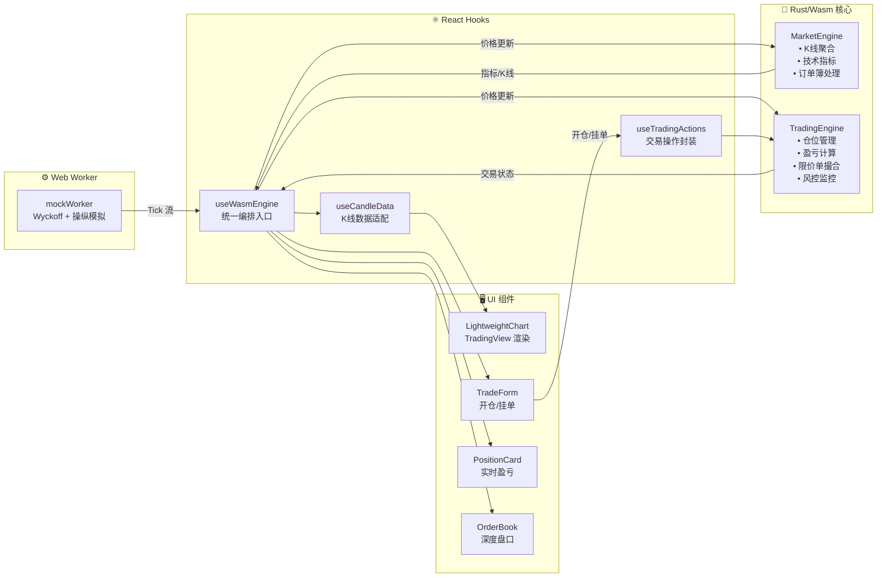
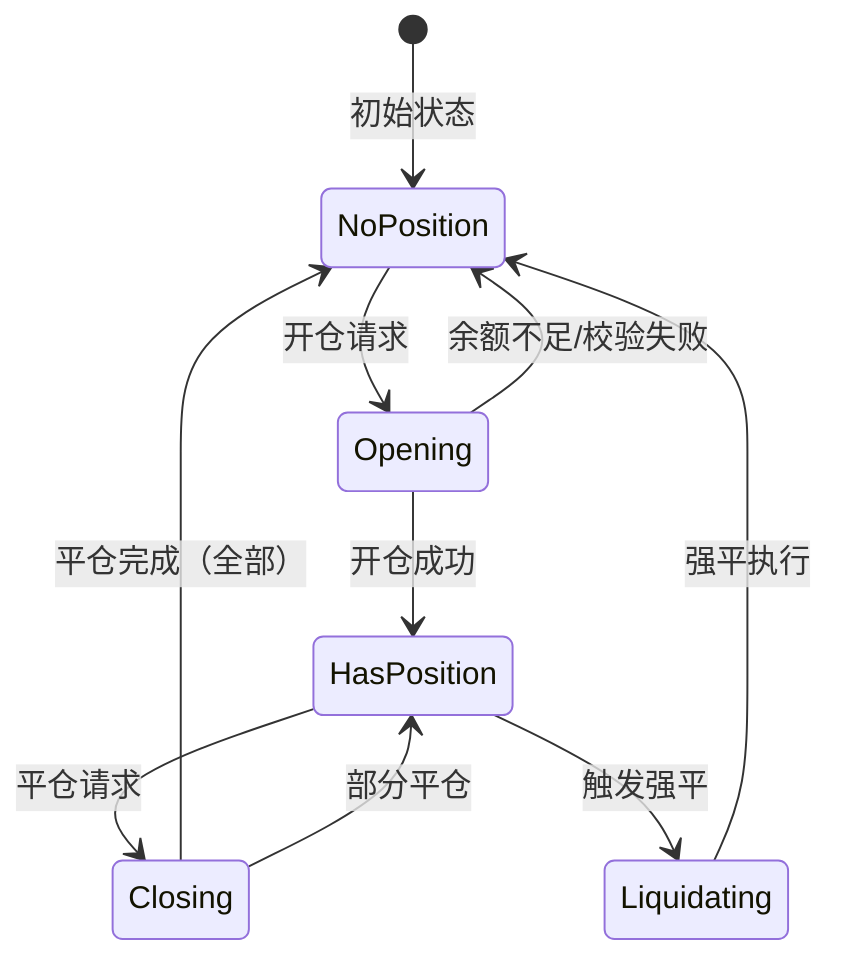

# RustQuantLab 产品需求文档

> **文档状态**: Active  
> **版本**: v0.2.0  
> **最后更新**: 2025-12-28

---

## 1. 项目概述

### 1.1 产品定位

**RustQuantLab** 是一款**高性能 Web 永续合约模拟交易终端**，基于 Rust/WebAssembly 技术实现客户端重计算架构（Client-Side Heavy Computing）。

### 1.2 核心价值

| 问题 | 方案 | 价值 |
|------|------|------|
| JavaScript 高频数据处理造成 UI 卡顿 | Rust/Wasm 接管所有计算密集型任务 | 毫秒级响应，60FPS 流畅渲染 |
| 用户需要零延迟的交易训练环境 | 客户端完整模拟引擎 | 无需后端，本地即时反馈 |
| 传统模拟行情过于简单 | Wyckoff 周期 + 市场操纵特征模拟 | 贴近真实市场行为 |

### 1.3 目标用户

- 量化交易学习者
- 合约交易新手（杠杆风险理解）
- 前端 Rust/Wasm 技术探索者

---

## 2. 技术架构

### 2.1 技术栈

| 层级 | 技术选型 | 版本 | 职责 |
|------|----------|------|------|
| **Logic Layer** | Rust → WebAssembly | 2021 Edition | 有状态交易引擎：K 线聚合、技术指标、交易撮合、风控强平 |
| **UI Layer** | React + TypeScript | 18.3 / 5.6 | 状态管理、组件渲染、用户交互 |
| **View Layer** | TradingView Lightweight Charts | 5.1 | 专业级 K 线图表渲染 |
| **Style Layer** | Tailwind CSS | 4.0 | 原子化样式，深色交易主题 |
| **Build Layer** | Vite + wasm-pack | 5.4 | 构建工具链 |

### 2.2 系统架构图



### 2.3 数据流

| 阶段 | 组件 | 职责 |
|------|------|------|
| **1. 行情生成** | `mockWorker.ts` | Wyckoff 周期 + 市场操纵特征模拟 |
| **2. 统一入口** | `useWasmEngine` | Wasm 单例、Tick 分发、状态聚合 |
| **3. 市场引擎** | `MarketEngine` (Rust) | K 线聚合、技术指标、订单簿 |
| **4. 交易引擎** | `TradingEngine` (Rust) | 仓位、盈亏、限价单、风控 |
| **5. 操作封装** | `useTradingActions` | 开仓/平仓/挂单/撤单 API |
| **6. 渲染** | React + TradingView | 60FPS K 线图、交易 UI |

---

## 3. 功能模块

### 3.1 模块一：高频行情模拟器 (Mock Data Generator)

**实现位置**: `src/workers/marketSimulation/`

#### 3.1.1 功能描述

- 基于 **Wyckoff 市场周期** 生成价格走势
- 模拟真实市场操纵特征（Scam Wicks, Bart Pattern, Stop Hunts）
- 支持 **情绪速度不对称性**（下跌如电梯，上涨如爬楼梯）
- 技术指标响应（80% 遵循，20% 破坏）

#### 3.1.2 业务规则

| 规则编号 | 规则描述 |
|---------|---------|
| R-001 | 默认推送间隔 **100ms**，可调节 |
| R-002 | 每次推送包含：`timestamp`、`price`、`volume`、`bids[]`、`asks[]` |
| R-003 | 订单簿深度：买卖各 **20 档** |
| R-004 | 价格精度：**2 位小数** |
| R-005 | 历史数据生成：支持 **1 分钟 K 线**，自动聚合到高周期 |

#### 3.1.3 市场模拟特征

```
Wyckoff 周期: ACCUMULATION → MARKUP → DISTRIBUTION → MARKDOWN → 循环

操纵事件:
- Scam Wick (插针): 快速刺穿支撑/阻力后回撤
- Bart Pattern: 横盘后的快速拉升/砸盘
- Cascade Liquidation: 连续触发止损引发的瀑布式清算
- Stop Hunt: 精准猎杀密集止损区
```

---

### 3.2 模块二：Rust 核心计算引擎 (MarketEngine)

**实现位置**: `core/src/engine/`

#### 3.2.1 K 线聚合系统

- **多周期支持**: 1s, 1m, 5m, 15m, 1H, 4H, 1D
- **实时聚合**: 每个 Tick 自动更新当前 K 线
- **历史加载**: 支持批量导入 1s K 线并自动聚合到所有高周期 (1m/5m/15m/1H/4H/1D)

**API**:
```rust
fn on_tick(&mut self, order_book: OrderBook) -> AnalysisResult;
fn set_timeframe(&mut self, timeframe: &str) -> bool;
fn get_active_candles(&self) -> CandleHistory;
fn load_history_1s_and_aggregate(&mut self, candles: Vec<Candle>) -> Vec<(String, usize)>;
```

#### 3.2.2 技术指标计算

**实现位置**: `core/src/indicators/`

| 指标 | 描述 | 参数 |
|------|------|------|
| **SMA** | 简单移动平均线 | period: 5, 10, 20 |
| **EMA** | 指数移动平均线 | period: 12, 26 |
| **BOLL** | 布林带 | period: 20, multiplier: 2 |
| **MACD** | 指数平滑异同移动平均线 | fast: 12, slow: 26, signal: 9 |
| **RSI** | 相对强弱指数 | period: 14 |

**设计原则**:
- **纯函数**: 无状态，相同输入始终相同输出
- **优雅降级**: 数据不足时返回 `None`
- **f64 精度**: 保证金融计算准确性

---

### 3.3 模块三：交易引擎 (Trading Engine)

**实现位置**: `core/src/trading/` + `core/src/engine/trading/`

#### 3.3.1 账户管理

| 功能 | 描述 | 规则 |
|------|------|------|
| **初始余额** | 模拟账户起始资金 | 默认 10,000 USDT |
| **杠杆设置** | 支持 1x - 125x | 有仓位时不可调整（逐仓模式） |
| **可用余额** | 余额 - 已用保证金 | 实时计算 |
| **账户重置** | 一键恢复初始状态 | 清空仓位、挂单、历史 |

#### 3.3.2 仓位管理

**开仓规则**:

| 规则编号 | 规则描述 |
|---------|---------|
| R-201 | 支持 **多空双向** 持仓（LONG / SHORT） |
| R-202 | 保证金模式：**全仓** 或 **逐仓** |
| R-203 | 开仓检查：可用余额 ≥ 所需保证金 |
| R-204 | 仓位 ID 格式：`{SYMBOL}_{SIDE}` (如 BTCUSDT_Long) |

**平仓规则**:

| 规则编号 | 规则描述 |
|---------|---------|
| R-211 | 支持 **全部平仓** 或 **部分平仓** |
| R-212 | 盈亏结算到余额 |
| R-213 | 逐仓模式：剩余保证金返还 |

**盈亏计算**:
```
多仓 PnL = (当前价 - 开仓价) × 数量
空仓 PnL = (开仓价 - 当前价) × 数量
ROE% = PnL / 保证金 × 100%
```

#### 3.3.3 限价单系统

| 功能 | 描述 |
|------|------|
| **挂单** | 指定价格开仓，冻结保证金 |
| **撮合** | 价格触及时自动成交 |
| **撤单** | 解冻保证金，返还余额 |
| **批量撤单** | 一键取消所有挂单 |

---

### 3.4 模块四：风控与强平引擎 (Risk Engine)

**实现位置**: `core/src/risk/`

#### 3.4.1 风险评估

| 指标 | 计算方式 |
|------|----------|
| **保证金率** | 仓位价值 / (仓位价值 - 未实现亏损) |
| **维持保证金** | 仓位价值 × 维持保证金率 |
| **强平价格** | 基于杠杆和方向计算的清算触发价 |

#### 3.4.2 风险等级

```rust
enum RiskLevel {
    Safe,      // 安全：保证金率 > 50%
    Warning,   // 预警：保证金率 25% - 50%
    Danger,    // 危险：保证金率 10% - 25%
    Critical,  // 临界：保证金率 < 10%
}
```

#### 3.4.3 强平逻辑

| 规则编号 | 规则描述 |
|---------|---------|
| R-301 | 当 **保证金率 ≤ 维持保证金率** 时触发强平 |
| R-302 | 强平以 **当前市价** 执行 |
| R-303 | 强平后发送 **LIQUIDATION** 事件通知 UI |
| R-304 | 逐仓模式：仅强平该仓位，不影响其他仓位 |

#### 3.4.4 逐仓增加保证金

- 支持为单个仓位增加保证金
- 降低强平风险，调整强平价格
- 从可用余额扣除

---

### 3.5 模块五：React 交易界面 (UI Layer)

**实现位置**: `src/components/Dashboard/`

#### 3.5.1 图表组件 (Chart)

| 组件 | 功能 |
|------|------|
| **LightweightChart** | TradingView K 线渲染 |
| **ChartToolbar** | 时间周期、指标切换、截图 |
| **IndicatorPane** | 副图指标（VOL/MACD/RSI） |

**支持功能**:
- 多时间周期切换：1s, 1m, 5m, 15m, 1H, 4H, 1D
- 主图指标：MA, EMA, BOLL（单选）
- 副图指标：VOL, MACD, RSI（多选）
- 实时 K 线更新（当前 K 线动态刷新）
- 图表截图导出

#### 3.5.2 订单簿组件 (OrderBook)

| 功能 | 描述 |
|------|------|
| **深度展示** | 买卖各 20 档 |
| **价格颜色** | 买绿卖红，涨跌变色 |
| **数量柱状图** | 横向柱状背景 |
| **最新成交价** | 中间显示，带趋势箭头 |

#### 3.5.3 交易表单 (TradeForm)

| 功能 | 描述 |
|------|------|
| **下单类型** | 市价单 / 限价单 |
| **方向选择** | 开多 (LONG) / 开空 (SHORT) |
| **数量输入** | 支持滑条快速选择 |
| **杠杆调节** | 1x - 125x 滑条 |
| **仓位卡片** | 显示未实现盈亏、ROE%、强平价 |
| **挂单列表** | 显示待成交订单，支持撤单 |

#### 3.5.4 响应式布局

| 断点 | 布局 |
|------|------|
| **Mobile** (<768px) | 垂直堆叠，底部固定交易栏 |
| **Tablet** (768-1280px) | 2 列网格 |
| **Desktop** (1280px+) | 3 列专业布局 |
| **4K** (2560px+) | 最大宽度限制，居中显示 |

---

## 4. 状态流转

### 4.1 仓位生命周期



### 4.2 限价单生命周期

```
Pending → [价格触及] → Filled
Pending → [用户取消] → Cancelled
Pending → [余额不足] → Rejected
```

### 4.3 引擎事件类型

| 事件 | 触发条件 | UI 响应 |
|------|----------|---------|
| `POSITION_OPENED` | 开仓成功 | Toast 通知 + 仓位卡片更新 |
| `POSITION_CLOSED` | 平仓成功 | Toast 通知 + 盈亏结算 |
| `ORDER_FILLED` | 限价单成交 | Toast 通知 + 仓位更新 |
| `ORDER_CANCELLED` | 挂单取消 | Toast 通知 + 保证金返还 |
| `LIQUIDATION` | 强平触发 | 警告 Toast + 仓位清零 |
| `MARGIN_ADDED` | 增加保证金 | Toast 通知 + 强平价更新 |

---

## 5. 项目结构

```
RustQuantLab/
├── core/                        # 🦀 Rust/Wasm 核心引擎
│   └── src/
│       ├── lib.rs               # Wasm 导出 API
│       ├── engine/              # 引擎模块
│       │   ├── market_engine/   # MarketEngine (K线/指标/订单簿)
│       │   ├── trading/         # 交易逻辑 (开仓/平仓/限价单)
│       │   └── data/            # K线聚合、Tick 处理
│       ├── trading/             # 交易领域模型 (仓位/订单/余额)
│       ├── indicators/          # 技术指标 (SMA/EMA/MACD/RSI/BOLL)
│       └── risk/                # 风控算法 (强平/保证金)
├── src/                         # ⚛️ React 前端
│   ├── components/Dashboard/
│   │   ├── Chart/               # TradingView Lightweight Charts
│   │   ├── Trade/               # 交易组件 (表单/仓位卡片)
│   │   └── OrderBook.tsx        # 订单簿
│   ├── hooks/
│   │   ├── useWasmEngine.ts     # 🎯 统一 Wasm 引擎入口
│   │   ├── tradingEngine/       # 交易操作封装
│   │   └── candle/              # K线数据处理
│   ├── workers/
│   │   └── marketSimulation/    # Wyckoff 行情模拟
│   └── App.tsx
└── package.json
```

---

## 6. 验收标准

| 验收项 | 标准 | 状态 |
|-------|------|------|
| **K 线渲染** | 60FPS 流畅拖拽，无卡顿 | ✅ |
| **多周期支持** | 1s/1m/5m/15m/1H/4H/1D 无缝切换 | ✅ |
| **技术指标** | SMA/EMA/BOLL/MACD/RSI 计算正确 | ✅ |
| **模拟交易** | 开仓/平仓/限价单完整流程 | ✅ |
| **风控强平** | 强平价计算准确，自动触发 | ✅ |
| **响应式 UI** | Mobile/Tablet/Desktop 自适应 | ✅ |
| **历史数据** | 支持加载并聚合历史 K 线 | ✅ |

---

## 7. 技术路线图

### 7.1 已完成 ✅

| 功能 | 说明 |
|------|------|
| Rust/Wasm 引擎 | 完整的市场分析 + 交易引擎 |
| 技术指标 | SMA/EMA/BOLL/MACD/RSI |
| 模拟交易 | 开仓/平仓/限价单/逐仓增加保证金 |
| 风控引擎 | 强平价格/保证金率/风险等级 |
| 专业 UI | TradingView 图表 + Binance 风格 |
| 行情模拟 | Wyckoff 周期 + 市场操纵特征 |

### 7.2 规划中 🚧

| 优先级 | 功能 | 目标 |
|:---:|------|------|
| P1 | 多交易对支持 | 同时持有多个品种仓位 |
| P2 | 历史交易记录 | IndexedDB 持久化 |
| P3 | 策略回测框架 | 基于历史 K 线验证策略 |
| P4 | 真实行情对接 | Binance WebSocket 接入 |

---

## 8. 版本历史

| 日期 | 版本 | 变更说明 |
|------|------|----------|
| 2025-12-28 | v0.2.0 | 完整交易引擎、风控强平、限价单、逐仓保证金 |
| 2025-12-20 | v0.1.0 | 初始版本：技术指标、K 线图表、基础交易 |

