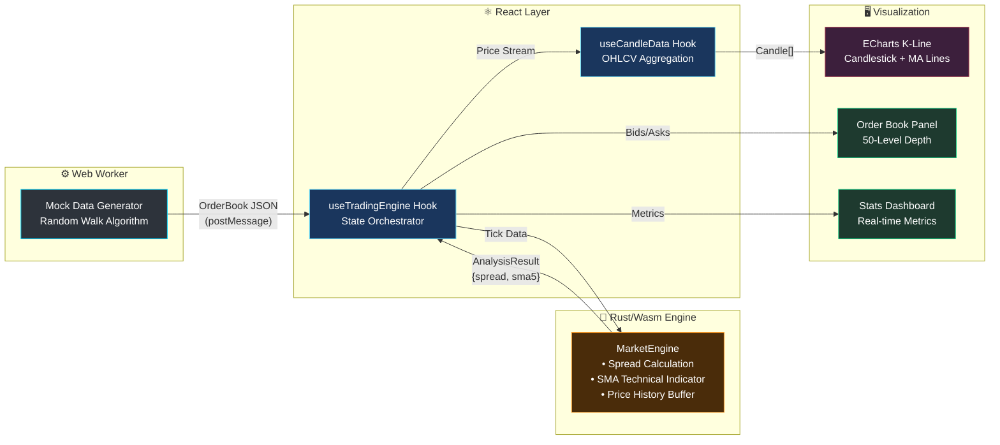

<div align="center">

# 🦀 RustQuantLab

**High-Performance Financial Terminal · Rust/Wasm + React + ECharts**

[](https://www.rust-lang.org/)
[](https://webassembly.org/)
[](https://react.dev/)
[](https://tailwindcss.com/)
[](https://echarts.apache.org/)
[](https://vitejs.dev/)
[](./LICENSE)

*A high-fidelity engineering showcase demonstrating sub-millisecond market data processing with Rust/WebAssembly, featuring a professional-grade trading terminal UI.*

</div>

---

## 📸 Snapshot


### ✨ Key Highlights

- **⚡ Rust-Powered Performance** — Core market analysis engine compiled to WebAssembly, handling high-frequency tick data with near-native speed
- **📊 Professional Trading UI** — TradingView/Binance-inspired dark theme with real-time K-line charts, order book visualization, and technical indicators
- **🌊 Organic Data Flow** — Simulated market heartbeat with burst-mode volatility patterns (50ms~1500ms adaptive intervals)
- **📱 4K Responsive Layout** — Fluid grid system optimized for screens from mobile to ultra-wide displays
- **🔄 Zero-Copy Bridge** — Efficient JS ↔ Rust data serialization via `serde-wasm-bindgen`

---

## 🔧 Workflow (Architecture)

The system implements a unidirectional data flow optimized for high-frequency financial data processing:



### Data Pipeline

| Stage | Component | Responsibility |
|-------|-----------|----------------|
| **1. Generation** | `mockWorker.ts` | Random-walk price simulation with burst-mode volatility |
| **2. Computation** | `MarketEngine` (Rust) | Spread calculation, SMA(5) indicator, history management |
| **3. Orchestration** | `useTradingEngine` | Wasm lifecycle, state coordination, price trend detection |
| **4. Aggregation** | `useCandleData` | Tick-to-OHLCV conversion, MA(5/10/20/30) computation |
| **5. Rendering** | React + ECharts | 60fps candlestick charts, depth visualization |

---

## 🛠️ Technology Stack

### Core Engine (Rust/Wasm)

| Crate | Version | Purpose |
|-------|---------|---------|
| `wasm-bindgen` | 0.2 | JS ↔ Rust FFI bridge |
| `serde` | 1.0 | Serialization framework |
| `serde-wasm-bindgen` | 0.4 | Zero-copy Wasm serialization |
| `console_error_panic_hook` | 0.1 | Debug-friendly panic messages |

### Frontend Stack

| Package | Version | Purpose |
|---------|---------|---------|
| **React** | 18.3 | UI component framework |
| **TypeScript** | 5.6 | Type-safe development |
| **Vite** | 5.4 | Next-gen build tooling |
| **Tailwind CSS** | 4.0 | Utility-first styling |
| **ECharts** | 6.0 | Professional charting library |
| **vite-plugin-wasm** | 3.3 | Seamless Wasm integration |

### Build Optimizations

```toml
# Cargo.toml - Release Profile
[profile.release]
opt-level = "s"    # Size optimization
lto = true         # Link-Time Optimization
```

---

## 🚀 Operation (Setup)

### Prerequisites

- **Node.js** ≥ 18.x
- **Rust** ≥ 1.70 ([Install via rustup](https://rustup.rs/))
- **wasm-pack** ([Installation Guide](https://rustwasm.github.io/wasm-pack/installer/))

### Quick Start

```bash
# 1. Clone the repository
git clone https://github.com/Duri686/RustQuantLab.git
cd RustQuantLab

# 2. Install frontend dependencies
npm install

# 3. Build Rust → WebAssembly module
cd core && wasm-pack build --target web --out-dir pkg && cd ..

# 4. Start development server
npm run dev
```

### Available Scripts

| Command | Description |
|---------|-------------|
| `npm run dev` | Build Wasm + Start Vite dev server (port 3000) |
| `npm run build` | Production build (Wasm + Vite) |
| `npm run build:wasm` | Compile Rust to WebAssembly only |
| `npm run preview` | Preview production build locally |
| `npm run lint` | Run ESLint checks |

---

## 📁 Project Structure

```
RustQuantLab/
├── core/                      # Rust/Wasm Engine
│   ├── src/lib.rs             # MarketEngine implementation
│   ├── Cargo.toml             # Rust dependencies
│   └── pkg/                   # Compiled Wasm output (generated)
├── src/
│   ├── components/
│   │   ├── Dashboard/         # StatsPanel, OrderBook
│   │   ├── Layout/            # Header, LoadingScreen, ErrorScreen
│   │   └── KLineChart.tsx     # ECharts candlestick component
│   ├── hooks/
│   │   ├── useTradingEngine.ts   # Main orchestrator hook
│   │   ├── useMockMarket.ts      # Worker communication
│   │   └── useCandleData.ts      # OHLCV aggregation
│   ├── workers/
│   │   └── mockWorker.ts      # Market data simulator
│   ├── types/index.ts         # TypeScript interfaces
│   └── App.tsx                # Root component
├── vite.config.ts             # Vite + Wasm plugin config
└── package.json
```

---

## 📜 License

[MIT](./LICENSE)
