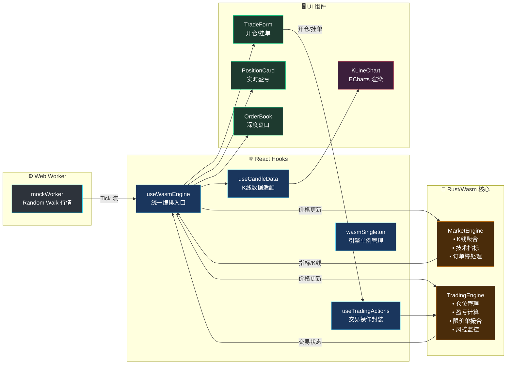

<div align="center">

# 🦀 RustQuantLab

**高性能 Web 永续合约模拟交易终端 · Rust/Wasm + React + ECharts**

[](https://www.rust-lang.org/)
[](https://webassembly.org/)
[](https://react.dev/)
[](https://tailwindcss.com/)
[](https://echarts.apache.org/)
[](https://vitejs.dev/)
[](./LICENSE)

*基于 Rust/WebAssembly 的本地永续合约模拟引擎，提供零延迟交易体验与专业级交易终端 UI。*

</div>

---

## 📸 Snapshot


### ✨ 核心亮点

- **⚡ Rust 驱动的高性能** — 核心交易引擎编译为 WebAssembly，毫秒级处理高频 Tick 数据
- **📈 完整模拟交易** — 支持多空开仓、杠杆调节 (1-125x)、实时盈亏计算、强平预警
- **📊 专业交易 UI** — 仿 Binance/TradingView 深色主题，实时 K 线、订单簿、技术指标
- **🛡️ 风控引擎** — 保证金率监控、强平价格计算、风险等级评估
- **📱 全端响应式** — 从移动端到 4K 超宽屏的流畅网格布局
- **🔄 零拷贝桥接** — 通过 `serde-wasm-bindgen` 实现高效 JS ↔ Rust 数据序列化

---

## 🔧 架构设计

系统采用**单一入口 + 双向数据流**设计：`useWasmEngine` 统一编排市场数据与交易状态。



### 数据管线

| 阶段 | 组件 | 职责 |
|------|------|------|
| **1. 行情生成** | `mockWorker.ts` | Random Walk 价格模拟，突发波动 |
| **2. 统一入口** | `useWasmEngine` | Wasm 单例、Tick 分发、状态聚合 |
| **3. 市场引擎** | `MarketEngine` (Rust) | K线聚合、技术指标、订单簿 |
| **4. 交易引擎** | `TradingEngine` (Rust) | 仓位、盈亏、限价单、风控 |
| **5. 操作封装** | `useTradingActions` | 开仓/平仓/挂单/撤单 API |
| **6. 渲染** | React + ECharts | 60FPS K线图、交易 UI |

---

## 🛠️ 技术栈

### 核心引擎 (Rust/Wasm)

| Crate | 版本 | 用途 |
|-------|------|------|
| `wasm-bindgen` | 0.2 | JS ↔ Rust FFI 桥接 |
| `serde` | 1.0 | 序列化框架 |
| `serde-wasm-bindgen` | 0.4 | 零拷贝 Wasm 序列化 |
| `js-sys` | 0.3 | JavaScript API 绑定 |
| `console_error_panic_hook` | 0.1 | 调试友好的 Panic 信息 |
| `criterion` | 0.5 | 性能基准测试 (dev) |

### 前端技术栈

| 包名 | 版本 | 用途 |
|------|------|------|
| **React** | 18.3 | UI 组件框架 |
| **TypeScript** | 5.6 | 类型安全开发 |
| **Vite** | 5.4 | 新一代构建工具 |
| **Tailwind CSS** | 4.0 | 原子化 CSS 框架 |
| **ECharts** | 6.0 | 专业图表库 |
| **echarts-for-react** | 3.0 | ECharts React 封装 |
| **Lucide React** | 0.562 | 现代图标库 |
| **vite-plugin-wasm** | 3.3 | Wasm 集成插件 |

### 构建优化

```toml
# Cargo.toml - Release Profile
[profile.release]
opt-level = "z"      # 最小体积优先
lto = true           # 链接时优化
codegen-units = 1    # 单代码单元
strip = true         # 移除调试符号
panic = "abort"      # 无 unwind 代码
```

---

## 🚀 快速开始

### 环境要求

- **Node.js** ≥ 18.x
- **Rust** ≥ 1.70 ([rustup 安装](https://rustup.rs/))
- **wasm-pack** ([安装指南](https://rustwasm.github.io/wasm-pack/installer/))

### 安装与运行

```bash
# 1. 克隆仓库
git clone https://github.com/Duri686/RustQuantLab.git
cd RustQuantLab

# 2. 安装前端依赖
npm install

# 3. 构建 Rust → WebAssembly 模块
cd core && wasm-pack build --target web --out-dir pkg && cd ..

# 4. 启动开发服务器
npm run dev
```

### 可用脚本

| 命令 | 描述 |
|------|------|
| `npm run dev` | 构建 Wasm + 启动 Vite 开发服务器 (3000 端口) |
| `npm run build` | 生产构建 (Wasm + Vite) |
| `npm run build:wasm` | 仅构建 Rust → WebAssembly |
| `npm run preview` | 本地预览生产构建 |
| `npm run lint` | 运行 ESLint 检查 |

---

## 📁 项目结构

```
RustQuantLab/
├── core/                          # 🦀 Rust/Wasm 核心
│   ├── src/
│   │   ├── lib.rs                 # Wasm 导出 API
│   │   ├── engine/                # 引擎模块
│   │   │   ├── market_engine/     # 市场数据引擎
│   │   │   │   ├── mod.rs         # MarketEngine 主体
│   │   │   │   ├── market_data.rs # 行情处理
│   │   │   │   ├── risk_control.rs# 风控检查
│   │   │   │   └── trade_executor.rs # 交易执行
│   │   │   ├── trading/           # 交易逻辑
│   │   │   │   ├── open_position.rs  # 开仓
│   │   │   │   ├── close_position.rs # 平仓
│   │   │   │   ├── limit_order.rs    # 限价单
│   │   │   │   └── risk_monitor.rs   # 风控监控
│   │   │   ├── data/              # 数据结构
│   │   │   │   ├── candles.rs     # K线聚合
│   │   │   │   └── tick_data.rs   # Tick 处理
│   │   │   └── types.rs           # 引擎类型定义
│   │   ├── trading/               # 交易领域模型
│   │   │   ├── position.rs        # 仓位模型
│   │   │   ├── orders.rs          # 订单模型
│   │   │   ├── balance.rs         # 余额管理
│   │   │   └── manager.rs         # 交易管理器
│   │   ├── indicators.rs          # 技术指标 (SMA/EMA/MACD/RSI/BOLL)
│   │   ├── models.rs              # 通用数据模型
│   │   └── risk.rs                # 风控算法
│   ├── Cargo.toml
│   └── pkg/                       # Wasm 编译输出
├── src/                           # ⚛️ React 前端
│   ├── components/
│   │   ├── Dashboard/
│   │   │   ├── Chart/             # K线图表
│   │   │   │   ├── index.tsx      # 图表容器
│   │   │   │   ├── chartModules/  # ECharts 配置模块
│   │   │   │   └── ChartToolbar.tsx # 工具栏
│   │   │   ├── Trade/             # 交易组件
│   │   │   │   ├── TradeForm.tsx  # 开仓表单
│   │   │   │   └── PositionCard.tsx # 仓位卡片
│   │   │   ├── OrderBook.tsx      # 订单簿
│   │   │   └── StatsPanel.tsx     # 统计面板
│   │   ├── Layout/                # 布局组件
│   │   └── Toast/                 # 通知系统
│   ├── hooks/
│   │   ├── useWasmEngine.ts       # 🎯 统一 Wasm 引擎入口
│   │   ├── useCandleData.ts       # K线数据适配
│   │   ├── useMockMarket.ts       # Mock 行情 Hook
│   │   ├── tradingEngine/         # 交易引擎 Hooks
│   │   │   ├── useTradingActions.ts # 交易操作封装
│   │   │   └── wasmSingleton.ts   # Wasm 单例管理
│   │   ├── tradingState/          # 交易状态
│   │   │   ├── eventHandler.ts    # 事件处理
│   │   │   └── types.ts           # 状态类型
│   │   └── candle/                # K线工具
│   │       ├── candleUtils.ts     # K线计算
│   │       └── useIndicatorHistory.ts # 指标历史
│   ├── types/                     # TypeScript 类型
│   │   ├── index.ts               # 通用类型
│   │   ├── trading.ts             # 交易类型
│   │   └── wasm.ts                # Wasm 接口类型
│   ├── workers/
│   │   └── mockWorker.ts          # 行情模拟 Worker
│   └── App.tsx                    # 根组件
├── ARCHITECTURE.md
├── vite.config.ts
└── package.json
```

---

## 📜 许可证

本项目采用 [CC BY-NC 4.0](./LICENSE) 许可证。

- ✅ 允许学习、研究、个人使用
- ✅ 允许修改和二次创作
- ❗ 必须标注来源并链接原项目
- ❌ 禁止商业用途
