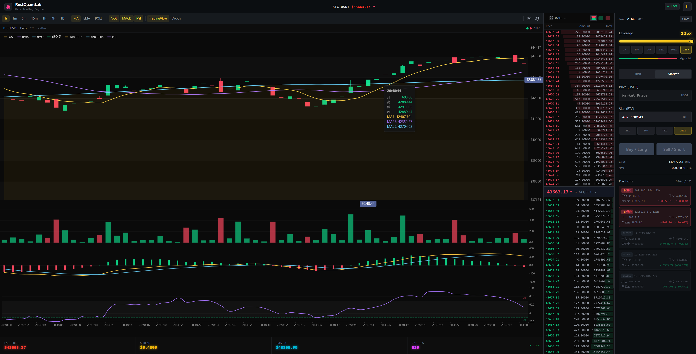
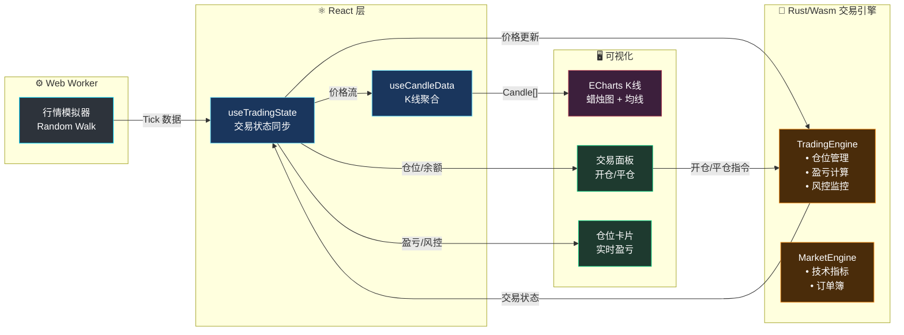

<div align="center">

# 🦀 RustQuantLab

**高性能 Web 永续合约模拟交易终端 · Rust/Wasm + React + ECharts**

[](https://www.rust-lang.org/)
[](https://webassembly.org/)
[](https://react.dev/)
[](https://tailwindcss.com/)
[](https://echarts.apache.org/)
[](https://vitejs.dev/)
[](./LICENSE)

*基于 Rust/WebAssembly 的本地永续合约模拟引擎，提供零延迟交易体验与专业级交易终端 UI。*

</div>

---

## 📸 Snapshot



### ✨ 核心亮点

- **⚡ Rust 驱动的高性能** — 核心交易引擎编译为 WebAssembly，毫秒级处理高频 Tick 数据
- **📈 完整模拟交易** — 支持多空开仓、杠杆调节 (1-125x)、实时盈亏计算、强平预警
- **📊 专业交易 UI** — 仿 Binance/TradingView 深色主题，实时 K 线、订单簿、技术指标
- **🛡️ 风控引擎** — 保证金率监控、强平价格计算、风险等级评估
- **📱 全端响应式** — 从移动端到 4K 超宽屏的流畅网格布局
- **🔄 零拷贝桥接** — 通过 `serde-wasm-bindgen` 实现高效 JS ↔ Rust 数据序列化

---

## 🔧 架构设计

系统采用**双向数据流**设计：市场数据单向流入，交易指令双向交互。



### 数据管线

| 阶段 | 组件 | 职责 |
|------|------|------|
| **1. 行情生成** | `mockWorker.ts` | 随机游走价格模拟，突发波动模式 |
| **2. 交易引擎** | `TradingEngine` (Rust) | 仓位管理、盈亏计算、强平检测 |
| **3. 指标计算** | `MarketEngine` (Rust) | SMA/EMA/MACD/RSI/BOLL 技术指标 |
| **4. 状态同步** | `useTradingState` | Wasm 生命周期、交易状态协调 |
| **5. K线聚合** | `useCandleData` | Tick → OHLCV 转换、均线计算 |
| **6. 渲染** | React + ECharts | 60FPS 蜡烛图、交易 UI |

---

## 🛠️ 技术栈

### 核心引擎 (Rust/Wasm)

| Crate | 版本 | 用途 |
|-------|------|------|
| `wasm-bindgen` | 0.2 | JS ↔ Rust FFI 桥接 |
| `serde` | 1.0 | 序列化框架 |
| `serde-wasm-bindgen` | 0.4 | 零拷贝 Wasm 序列化 |
| `console_error_panic_hook` | 0.1 | 调试友好的 Panic 信息 |

### 前端技术栈

| 包名 | 版本 | 用途 |
|------|------|------|
| **React** | 18.3 | UI 组件框架 |
| **TypeScript** | 5.6 | 类型安全开发 |
| **Vite** | 5.4 | 新一代构建工具 |
| **Tailwind CSS** | 4.0 | 原子化 CSS 框架 |
| **ECharts** | 6.0 | 专业图表库 |
| **vite-plugin-wasm** | 3.3 | Wasm 集成插件 |

### 构建优化

```toml
# Cargo.toml - Release Profile
[profile.release]
opt-level = "s"    # 尺寸优化
lto = true         # 链接时优化
```

---

## 🚀 快速开始

### 环境要求

- **Node.js** ≥ 18.x
- **Rust** ≥ 1.70 ([rustup 安装](https://rustup.rs/))
- **wasm-pack** ([安装指南](https://rustwasm.github.io/wasm-pack/installer/))

### 安装与运行

```bash
# 1. 克隆仓库
git clone https://github.com/Duri686/RustQuantLab.git
cd RustQuantLab

# 2. 安装前端依赖
npm install

# 3. 构建 Rust → WebAssembly 模块
cd core && wasm-pack build --target web --out-dir pkg && cd ..

# 4. 启动开发服务器
npm run dev
```

### 可用脚本

| 命令 | 描述 |
|------|------|
| `npm run dev` | 构建 Wasm + 启动 Vite 开发服务器 (3000 端口) |
| `npm run build` | 生产构建 (Wasm + Vite) |
| `npm run build:wasm` | 仅构建 Rust → WebAssembly |
| `npm run preview` | 本地预览生产构建 |
| `npm run lint` | 运行 ESLint 检查 |

---

## 📁 项目结构

```
RustQuantLab/
├── core/                      # Rust/Wasm 交易引擎
│   ├── src/
│   │   ├── lib.rs             # Wasm 导出 API
│   │   ├── engine/            # 交易引擎核心
│   │   │   ├── mod.rs         # TradingEngine 实现
│   │   │   ├── risk.rs        # 风控与强平逻辑
│   │   │   └── position.rs    # 仓位管理
│   │   └── indicators.rs      # 技术指标 (SMA/EMA/MACD/RSI/BOLL)
│   ├── Cargo.toml             # Rust 依赖
│   └── pkg/                   # 编译输出 (自动生成)
├── src/
│   ├── components/
│   │   ├── Dashboard/         # 交易面板组件
│   │   │   ├── Chart/         # K线图容器
│   │   │   └── Trade/         # 交易表单、仓位卡片
│   │   ├── Layout/            # 布局组件
│   │   └── Toast/             # 通知组件
│   ├── hooks/
│   │   ├── useTradingState.ts # 交易状态管理
│   │   ├── useTradingEngine.ts # Wasm 引擎编排
│   │   └── useCandleData.ts   # K线数据聚合
│   ├── types/                 # TypeScript 类型定义
│   ├── workers/               # Web Workers
│   └── App.tsx                # 根组件
├── ARCHITECTURE.md            # 架构设计文档
├── vite.config.ts             # Vite 配置
└── package.json
```

---

## 📜 许可证

本项目采用 [CC BY-NC 4.0](./LICENSE) 许可证。

- ✅ 允许学习、研究、个人使用
- ✅ 允许修改和二次创作
- ❗ 必须标注来源并链接原项目
- ❌ 禁止商业用途
