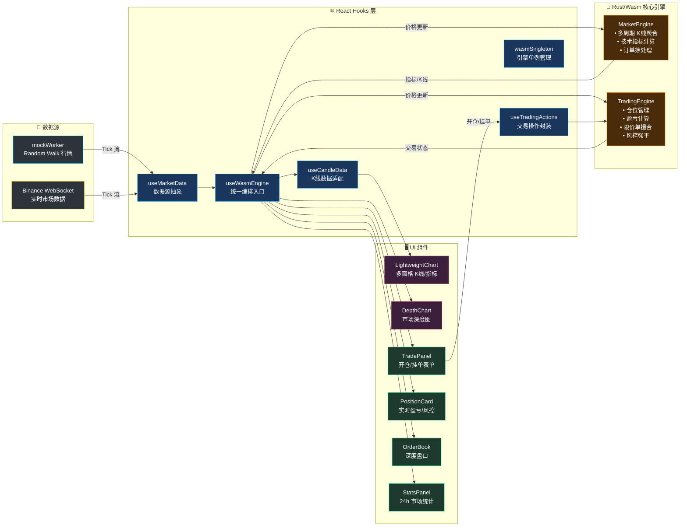

<div align="center">

# 🦀 RustQuantLab

**高性能 Web 永续合约模拟交易终端 · Rust/Wasm + React + TradingView**

[](https://www.rust-lang.org/)
[](https://webassembly.org/)
[](https://react.dev/)
[](https://www.tradingview.com/lightweight-charts/)
[](https://tailwindcss.com/)
[](https://vitejs.dev/)
[](./LICENSE)
[](https://deepwiki.com/Duri686/RustQuantLab)

*基于 Rust/WebAssembly 的本地永续合约模拟引擎，提供零延迟交易体验与专业级交易终端 UI。*

</div>

---

## 📸 Snapshot


### ✨ 核心亮点

- **⚡ Rust 驱动的高性能** — 核心交易引擎编译为 WebAssembly，毫秒级处理高频 Tick 数据，`on_tick_full` 单次跨边界调用合并分析+K线+交易状态
- **📈 完整模拟交易** — 支持多空开仓、杠杆调节 (1-125x)、市价/限价单、逐仓/全仓保证金、实时盈亏计算、强平预警
- **📊 专业交易 UI** — Binance 风格深色主题，TradingView Lightweight Charts K 线图、深度图、订单簿、24h 市场统计
- **🛡️ 风控引擎** — 保证金率监控、强平价格计算、四级风险等级评估 (Safe/Warning/Danger/Critical)、逐仓追加保证金
- **📱 全端响应式** — 从移动端到 4K 超宽屏的流畅网格布局，底部交易栏 + BottomSheet 移动适配
- **🔄 双数据源** — Mock 模拟行情 (Random Walk) 与 Binance WebSocket 实时行情一键切换
- **🧩 零拷贝桥接** — 通过 `serde-wasm-bindgen 0.6` 实现高效 JS ↔ Rust 数据序列化

---

## 🔧 架构设计

系统采用**单一入口 + 双向数据流**设计：`useWasmEngine` 统一编排市场数据与交易状态，React 只做 UI 搬运工，所有计算在 Rust 引擎中完成。



### 数据管线

| 阶段 | 组件 | 职责 |
|------|------|------|
| **1. 行情生成** | `mockWorker.ts` / `useBinanceMarket` | Mock: Random Walk 模拟 · Binance: WebSocket 实时数据 |
| **2. 数据源抽象** | `useMarketData` | 统一 Mock/Binance 接口，管理历史 K 线请求 |
| **3. 统一入口** | `useWasmEngine` | Wasm 单例初始化、Tick 分发、`on_tick_full` 合并调用 |
| **4. 市场引擎** | `MarketEngine` (Rust) | 多周期 K 线聚合 (1s→1D)、SMA/EMA/BOLL/MACD/RSI |
| **5. 交易引擎** | `TradingEngine` (Rust) | 仓位管理、盈亏计算、限价单撮合、风控强平 |
| **6. 操作封装** | `useTradingActions` | 开仓/平仓/挂单/撤单/追加保证金/预估强平 API |
| **7. 渲染** | React + TradingView | 60FPS K 线图、深度图、交易 UI |

---

## 🛠️ 技术栈

### 核心引擎 (Rust/Wasm)

| Crate | 版本 | 用途 |
|-------|------|------|
| `wasm-bindgen` | 0.2 | JS ↔ Rust FFI 桥接 |
| `serde` | 1.0 | 序列化框架 |
| `serde-wasm-bindgen` | 0.6 | 高效 Wasm 序列化 |
| `js-sys` | 0.3 | JavaScript API 绑定 |
| `web-sys` | 0.3 | Web API 绑定 (console) |
| `console_error_panic_hook` | 0.1 | 调试友好的 Panic 信息 |
| `criterion` | 0.5 | 性能基准测试 (dev) |

### 前端技术栈

| 包名 | 版本 | 用途 |
|------|------|------|
| **React** | 18.3 | UI 组件框架 |
| **TypeScript** | 5.6 | 类型安全开发 |
| **Vite** | 5.4 | 新一代构建工具 |
| **Tailwind CSS** | 4.0 | 原子化 CSS 框架 (Design Token 体系) |
| **Lightweight Charts** | 5.1 | TradingView 专业 K 线图表 |
| **Zustand** | 4.5 | 轻量级状态管理 (UI 状态/数据源切换) |
| **ahooks** | 3.9 | React Hooks 工具库 (防抖/倒计时等) |
| **Lucide React** | 0.562 | 现代图标库 |
| **@react-spring/web** | 10.0 | 物理动画引擎 |
| **@use-gesture/react** | 10.3 | 手势交互 (拖拽/滑动) |
| **vite-plugin-wasm** | 3.3 | Wasm 集成插件 |

### 构建优化

```toml
# Cargo.toml - Release Profile
[profile.release]
opt-level = "s"      # 平衡体积与运行速度
lto = true           # 链接时优化
codegen-units = 1    # 单代码单元，更好的优化
strip = true         # 移除调试符号
panic = "abort"      # 无 unwind 代码
```

---

## 🚀 快速开始

### 环境要求

- **Node.js** ≥ 18.x
- **Rust** ≥ 1.70 ([rustup 安装](https://rustup.rs/))
- **wasm-pack** ([安装指南](https://rustwasm.github.io/wasm-pack/installer/))

### 安装与运行

```bash
# 1. 克隆仓库
git clone https://github.com/Duri686/RustQuantLab.git
cd RustQuantLab

# 2. 安装前端依赖
npm install

# 3. 构建 Rust → WebAssembly 模块
cd core && wasm-pack build --target web --out-dir pkg && cd ..

# 4. 启动开发服务器
npm run dev
```

### 可用脚本

| 命令 | 描述 |
|------|------|
| `npm run dev` | 构建 Wasm + 启动 Vite 开发服务器 (3000 端口) |
| `npm run build` | 生产构建 (Wasm + Vite) |
| `npm run build:wasm` | 仅构建 Rust → WebAssembly |
| `npm run preview` | 本地预览生产构建 |
| `npm run lint` | 运行 ESLint 检查 |
| `npm run test:rust` | 运行 Rust 单元测试 |
| `npm run bench` | 运行 Rust 性能基准测试 |

---

## 📁 项目结构

```
RustQuantLab/
├── core/                           # 🦀 Rust/Wasm 核心引擎
│   ├── src/
│   │   ├── lib.rs                  # Wasm 导出 API + 模块声明
│   │   ├── models.rs               # 核心数据模型 (OrderBook/Candle/AnalysisResult)
│   │   ├── engine/                 # 引擎模块
│   │   │   ├── market_engine/      # MarketEngine (K线聚合/指标计算/订单簿)
│   │   │   ├── trading/            # 交易逻辑 (开仓/平仓/限价单撮合/风控)
│   │   │   ├── data/               # K线聚合器、Tick 数据管理
│   │   │   └── types.rs            # 引擎事件类型 (EngineEvent/TradingState)
│   │   ├── trading/                # 交易领域模型
│   │   │   ├── position.rs         # 仓位结构与生命周期
│   │   │   ├── orders.rs           # 限价单/挂单管理
│   │   │   ├── balance.rs          # 账户余额与保证金
│   │   │   └── manager.rs          # 仓位管理器 (开仓/平仓/加仓)
│   │   ├── indicators/             # 技术指标 (纯函数, 无状态)
│   │   │   ├── ma.rs               # SMA / EMA
│   │   │   ├── boll.rs             # 布林带
│   │   │   ├── macd.rs             # MACD
│   │   │   └── rsi.rs              # RSI
│   │   └── risk/                   # 风控与强平
│   │       ├── liquidation.rs      # 强平价格计算
│   │       ├── margin.rs           # 保证金率计算
│   │       └── types.rs            # 风险等级 (Safe/Warning/Danger/Critical)
│   ├── benches/                    # Criterion 性能基准测试
│   └── Cargo.toml
├── src/                            # ⚛️ React 前端
│   ├── components/
│   │   ├── Dashboard/
│   │   │   ├── Chart/              # 图表区域
│   │   │   │   ├── LightweightChart/  # TradingView 多窗格图表系统
│   │   │   │   ├── ChartToolbar.tsx   # 时间周期/指标/数据源切换
│   │   │   │   └── DepthChart.tsx     # 市场深度图
│   │   │   ├── Trade/              # 交易区域
│   │   │   │   ├── TradePanel.tsx     # 交易表单 (市价/限价/杠杆)
│   │   │   │   ├── PositionCard.tsx   # 仓位卡片 (盈亏/风控/挂单)
│   │   │   │   └── LeverageSlider.tsx # 杠杆滑条 (1-125x)
│   │   │   ├── OrderBook.tsx       # 订单簿 (买卖各20档)
│   │   │   └── StatsPanel.tsx      # 24h 市场统计
│   │   ├── Layout/                 # 布局组件
│   │   │   ├── Header.tsx          # 顶部导航 (数据源切换/FPS/内存)
│   │   │   ├── ErrorScreen.tsx     # 错误页面
│   │   │   └── LoadingScreen.tsx   # 加载骨架屏
│   │   └── Toast/                  # Toast 通知系统
│   ├── hooks/
│   │   ├── useWasmEngine.ts        # 🎯 统一 Wasm 引擎入口
│   │   ├── useMarketData.ts        # 数据源抽象层 (Mock/Binance 切换)
│   │   ├── useBinanceMarket.ts     # Binance WebSocket 实时数据
│   │   ├── useMockMarket.ts        # Mock 模拟数据
│   │   ├── useMarketStats.ts       # 24h 市场统计 (涨跌幅/成交量/倒计时)
│   │   ├── useCandleData.ts        # K线数据适配
│   │   ├── useFpsMonitor.ts        # FPS 性能监控
│   │   ├── tradingEngine/          # 交易操作封装
│   │   │   ├── useTradingActions.ts   # 开仓/平仓/挂单/撤单/追加保证金
│   │   │   └── wasmSingleton.ts       # Wasm 引擎单例 + 内存监控
│   │   ├── tradingState/           # 交易状态处理
│   │   │   ├── eventHandler.ts        # 引擎事件 → Toast 通知
│   │   │   └── types.ts              # 交易 Wasm 接口类型
│   │   ├── candle/                 # K线工具
│   │   └── ui/                     # UI 状态
│   │       ├── useUiStore.ts          # Zustand UI 状态管理
│   │       └── useBottomSheet.ts      # 移动端底部弹层
│   ├── workers/
│   │   └── mockWorker.ts           # Web Worker: Random Walk 行情模拟
│   └── App.tsx                     # 应用根组件 (Composition Root)
├── docs/                           # 📚 文档
│   ├── ROADMAP.md                  # 项目路线图
│   └── design/                     # 设计文档
├── .github/workflows/              # GitHub Actions (自动部署)
└── package.json
```

---

## 📜 许可证

本项目采用 [CC BY-NC 4.0](./LICENSE) 许可证。

- ✅ 允许学习、研究、个人使用
- ✅ 允许修改和二次创作
- ❗ 必须标注来源并链接原仓库
- ❌ 禁止商业用途
