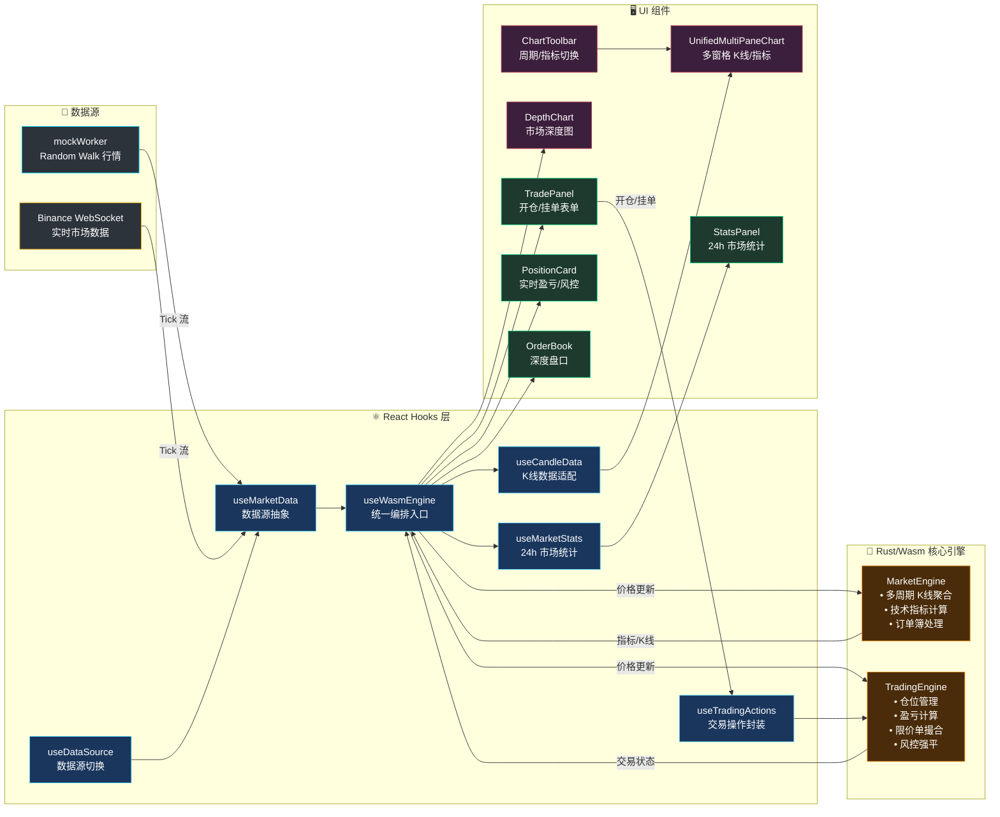

<div align="center">

# 🦀 RustQuantLab

**高性能 Web 永续合约模拟交易终端 · Rust/Wasm + React + TradingView**

[](https://www.rust-lang.org/)
[](https://webassembly.org/)
[](https://react.dev/)
[](https://www.tradingview.com/lightweight-charts/)
[](https://tailwindcss.com/)
[](https://vitejs.dev/)
[](./LICENSE)
[](https://deepwiki.com/Duri686/RustQuantLab)

*基于 Rust/WebAssembly 的本地永续合约模拟引擎，提供零延迟交易体验与专业级交易终端 UI。*

</div>

---

## 📸 Snapshot


### ✨ 核心亮点

- **⚡ Rust 驱动的高性能** — 核心交易引擎编译为 WebAssembly，毫秒级处理高频 Tick 数据，`on_tick_full` 单次跨边界调用合并分析+K线+交易状态
- **📈 完整模拟交易** — 支持多空开仓、杠杆调节 (1-125x)、市价/限价单、逐仓/全仓保证金、实时盈亏计算、强平预警
- **📊 专业交易 UI** — Binance 风格深色主题，TradingView Lightweight Charts K 线图、深度图、订单簿、24h 市场统计
- **🛡️ 风控引擎** — 保证金率监控、强平价格计算、四级风险等级评估 (Safe/Warning/Danger/Critical)、逐仓追加保证金
- **📱 全端响应式** — 从移动端到 4K 超宽屏的流畅网格布局，底部交易栏 + BottomSheet 移动适配
- **🔄 双数据源** — Mock 模拟行情 (Random Walk) 与 Binance WebSocket 实时行情一键切换
- **🧩 零拷贝桥接** — 通过 `serde-wasm-bindgen 0.6` 实现高效 JS ↔ Rust 数据序列化

---

## 🔧 架构设计

系统采用**单一入口 + 双向数据流**设计：`useWasmEngine` 统一编排市场数据与交易状态，React 只做 UI 搬运工，所有计算在 Rust 引擎中完成。



---

## 🚀 快速开始

### 环境要求

- **Node.js** ≥ 18.x
- **Rust** ≥ 1.70 ([rustup 安装](https://rustup.rs/))
- **wasm-pack** ([安装指南](https://rustwasm.github.io/wasm-pack/installer/))

### 安装与运行

```bash
# 1. 克隆仓库
git clone https://github.com/Duri686/RustQuantLab.git
cd RustQuantLab

# 2. 安装前端依赖
npm install

# 3. 构建 Rust → WebAssembly 模块
cd core && wasm-pack build --target web --out-dir pkg && cd ..

# 4. 启动开发服务器
npm run dev
```

## 📁 项目结构

| 目录 | 说明 |
|------|------|
| `core/` | 🦀 Rust/Wasm 核心引擎 (K线聚合、技术指标、交易撮合、风控强平) |
| `src/` | ⚛️ React 前端 (图表、交易面板、订单簿、状态管理) |
| `docs/` | 📚 设计文档与路线图 |

---

## 📜 许可证

本项目采用 [CC BY-NC 4.0](./LICENSE) 许可证。

- ✅ 允许学习、研究、个人使用
- ✅ 允许修改和二次创作
- ❗ 必须标注来源并链接原仓库
- ❌ 禁止商业用途
