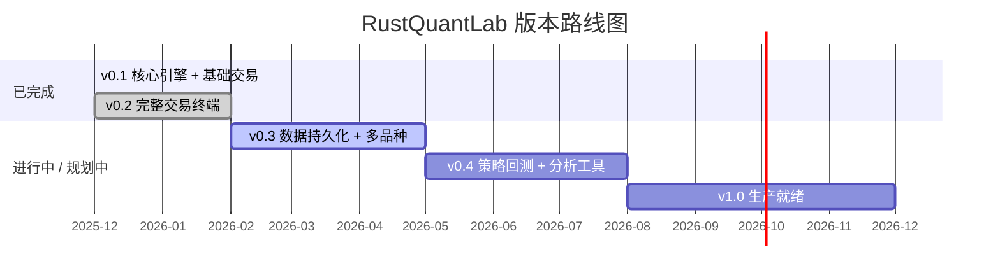

# 🗺️ RustQuantLab 项目路线图

> **文档状态**: Active
> **最后更新**: 2026-02-07
> **当前版本**: v0.2.x

---

## 版本总览

---

## ✅ v0.1 — 核心引擎与基础交易 (已完成)

> 从零搭建 Rust/Wasm 计算引擎 + React 交易 UI 的基础框架。

| 功能 | 说明 |
|------|------|
| Rust/Wasm 引擎 | MarketEngine 基础结构、Wasm 编译链路 |
| 技术指标 | SMA、EMA、BOLL、MACD、RSI (纯函数实现) |
| K 线图表 | ECharts → TradingView Lightweight Charts 迁移 |
| 基础交易 | 市价开仓/平仓、实时盈亏计算 |
| Mock 行情 | Web Worker Random Walk 价格模拟 |

---

## ✅ v0.2 — 完整交易终端 (当前版本)

> 构建功能完整的永续合约模拟交易终端，对标 Binance 交易体验。

### 已完成功能

| 模块 | 功能 | 说明 |
|------|------|------|
| **交易引擎** | 限价单系统 | 挂单/撮合/撤单/批量撤单，保证金冻结与释放 |
| | 逐仓/全仓模式 | 双保证金模式，逐仓支持追加保证金降低强平风险 |
| | 加仓合并 | 同向追加仓位，自动计算新均价和杠杆 |
| | `on_tick_full` 优化 | 合并 on_tick + get_active_candles + get_trading_state 为单次 Wasm 调用 |
| **风控引擎** | 四级风险评估 | Safe / Warning / Danger / Critical，节流 Toast 通知 |
| | 强平执行 | 保证金率 ≤ 维持保证金率时自动强平，逐仓隔离 |
| | 预估强平价 | 下单前实时计算强平价格，辅助风险决策 |
| **数据源** | Binance WebSocket | 实时行情对接，支持历史 K 线加载 |
| | 数据源切换 | Mock ↔ Binance 一键切换，`useMarketData` 统一抽象 |
| | 历史数据聚合 | 1s K 线批量加载并自动聚合到 1m/5m/15m/1H/4H/1D |
| **图表** | 多窗格图表 | 主图 (K线 + MA/EMA/BOLL) + 副图 (VOL/MACD/RSI) |
| | 深度图 | 买卖深度可视化，支持 K线/深度图 切换 |
| | 可视区域极值 | 当前视口内最高/最低价标记 |
| **UI/UX** | 24h 市场统计 | 涨跌幅、成交量、最高/最低价、K 线收盘倒计时 |
| | Zustand 状态管理 | 数据源切换过渡、骨架屏反馈 |
| | 设计系统重构 | Binance 对齐配色、Tailwind Design Token 体系 |
| | 响应式布局 | Mobile (底部交易栏 + BottomSheet) / Tablet / Desktop / 4K |
| **工程化** | FPS 监控 | 实时帧率显示，性能瓶颈可视化 |
| | Wasm 内存监控 | 实时显示 WASM 线性内存使用量 |
| | Husky + ESLint | Git pre-commit 自动检查 |
| | GitHub Actions | 自动部署流水线 |

---

## 🚧 v0.3 — 数据持久化与多品种 (规划中)

> **核心目标**: 让交易数据可追溯，支持多交易对模拟。

### 里程碑目标

| 优先级 | 功能 | 描述 | 技术方案 |
|:---:|------|------|----------|
| **P0** | **交易历史持久化** | 开仓/平仓/强平记录本地存储，支持查看历史交易 | IndexedDB (via Dexie.js 或原生 API) |
| **P0** | **账户状态持久化** | 余额、仓位、挂单在刷新后恢复 | IndexedDB + Wasm 状态序列化 |
| **P1** | **多交易对支持** | 同时持有 BTC/ETH/SOL 等多品种仓位 | Rust `HashMap<Symbol, Position>` 扩展 |
| **P1** | **交易统计面板** | 胜率、盈亏比、最大回撤、夏普比率等绩效指标 | 新增 `StatsPage` 组件 |
| **P2** | **Binance 多品种行情** | 扩展 WebSocket 订阅多个交易对 | `useBinanceMarket` 多流管理 |
| **P2** | **交易记录导出** | CSV/JSON 格式导出历史交易 | Blob + download |

### UX 改进 (源自 [v0.2 UX 审计](UX_AUDIT_v0.2.md))

| 优先级 | 功能 | 描述 |
|:---:|------|------|
| **P0** | **UI 语言统一** | 中文优先策略，保留行业惯用英文术语 (Long/Short/USDT)，建立 UI 文案 Glossary |
| **P1** | **交易表单优化** | Size 输入增加 "Max" 按钮、市价单价格区域改为信息展示样式、历史仓位支持展开全部 |
| **P1** | **LIVE 模式交易提示** | Binance 模式下显示交易面板 disabled 态 + 说明文案，而非完全隐藏 |
| **P2** | **账户操作安全网** | 账户重置增加确认弹窗、平仓增加二次确认 |

### 预期交付

- 交易历史列表 UI (含筛选/分页)
- 账户状态跨会话保持
- ≥ 3 个交易对 (BTCUSDT / ETHUSDT / SOLUSDT)
- 基础绩效统计仪表盘
- UI 语言统一 + 交易表单可用性提升

---

## 📋 v0.4 — 策略回测与分析工具 (规划中)

> **核心目标**: 从「手动交易模拟器」进化为「策略验证平台」。

### 里程碑目标

| 优先级 | 功能 | 描述 | 技术方案 |
|:---:|------|------|----------|
| **P0** | **K 线历史回放** | 加载历史数据，按速度回放行情，手动验证策略 | Rust 引擎时间控制 + 播放器 UI |
| **P0** | **策略回测引擎** | 编写简单策略规则，在历史数据上自动执行 | Rust 回测核心 + 策略 DSL |
| **P1** | **回测报告** | 可视化收益曲线、交易标注、关键指标 | Chart 注解 + 报告页面 |
| **P1** | **更多技术指标** | KDJ、ATR、OBV、VWAP 等 | `core/src/indicators/` 扩展 |
| **P2** | **图表绘图工具** | 趋势线、水平线、斐波那契回撤等标注工具 | Lightweight Charts 插件 |
| **P2** | **价格提醒** | 设置价格触发通知 (浏览器 Notification) | Web Notification API |

### UX 改进 (源自 [v0.2 UX 审计](UX_AUDIT_v0.2.md))

| 优先级 | 功能 | 描述 |
|:---:|------|------|
| **P0** | **新手引导流程** | 首次访问 Tooltip Tour (3-5 步)、关键术语 Tooltip (杠杆/逐仓/强平价)、帮助入口 |
| **P1** | **风险可视化升级** | 强平距离改为进度条、保证金率仪表盘、Critical 状态优化 (取消持续 pulse) |
| **P1** | **移动端交易优化** | 快捷下单数量可配置、BottomSheet 上滑指示器、图表/订单簿高度可拖拽 |
| **P2** | **交易音效** | 可选的交易事件音效 (开仓/强平/限价成交) |

### 预期交付

- 可回放的 K 线历史播放器
- 基础策略回测框架 (≥ 2 种内置策略: MA 交叉、RSI 超卖反弹)
- 回测收益曲线与交易标注
- ≥ 3 个新增技术指标
- 新手引导流程 + 风险可视化升级

---

## 🎯 v1.0 — 生产就绪 (远期目标)

> **核心目标**: 可靠、可扩展、可分享的专业交易模拟平台。

### 里程碑目标

| 优先级 | 功能 | 描述 | 技术方案 |
|:---:|------|------|----------|
| **P0** | **Wasm Web Worker** | 将 Rust 引擎移至 Web Worker，彻底释放主线程 | Comlink + Worker 通信 |
| **P0** | **性能基线建立** | Criterion 基准测试覆盖核心路径，CI 防劣化 | `core/benches/` 扩展 + GitHub Actions |
| **P1** | **PWA 支持** | 离线可用、添加到主屏幕 | Vite PWA 插件 |
| **P1** | **国际化 (i18n)** | 中文/英文双语 UI | react-i18next |
| **P1** | **主题系统** | 亮色/暗色/自定义主题切换 | CSS 变量 + Zustand |
| **P2** | **策略分享社区** | 用户分享回测策略与成绩 | 需后端服务支持 |
| **P2** | **真实交易对接** | 对接交易所 API (只读/模拟单) | 需安全审计 |
| **P2** | **移动端原生体验** | 手势优化、触觉反馈、全屏沉浸 | @use-gesture 深度集成 |
| **P2** | **无障碍 (a11y)** | ARIA 标签、键盘导航、色盲友好 (风险图标辅助)、触摸目标 ≥ 44px | WAI-ARIA + 设计规范 |
| **P2** | **信息密度切换** | 紧凑/标准/舒适三档 UI 密度 | Zustand + Tailwind 变量 |

### 预期交付

- Lighthouse Performance Score ≥ 90
- 首屏加载时间 < 2s
- Wasm 引擎完全 off-main-thread
- PWA 可安装
- 中英双语完整覆盖
- WCAG 2.1 AA 基础合规

---

## 技术债务与优化清单

> 已知需要持续改进的技术项，可在任何版本中穿插处理。

| 类别 | 项目 | 说明 |
|------|------|------|
| **架构** | ~~ARCHITECTURE.md 同步更新~~ | ✅ 已于 v0.2 完成更新 (2026-02-07) |
| **架构** | 类型统一 | 减少 `as unknown as TradingWasmEngine` 类型断言 |
| **性能** | Tick 处理节流优化 | 当前 10ms 最小间隔保护，评估是否可用 RAF 替代 |
| **性能** | React 渲染优化 | 高频状态更新场景下的 memo/useMemo 审计 |
| **Rust** | 错误处理统一 | 引擎内部错误传播链优化，减少 unwrap |
| **测试** | Rust 集成测试覆盖 | 交易流程端到端测试 (开仓→持仓→强平) |
| **测试** | 前端组件测试 | 关键交互流程的 E2E 测试 |
| **DX** | HMR Wasm 热更新 | 当前需手动重新构建 Wasm，优化开发体验 |
| **UX** | 中英文混杂 | UI 文案缺乏统一规范，需建立 Glossary (详见 [UX 审计](UX_AUDIT_v0.2.md)) |
| **UX** | 移动端快捷下单硬编码 | 底部 Buy/Sell 固定 0.01 BTC，需改为可配置 |

---

## 如何贡献

1. 查看上方路线图，选择感兴趣的功能模块
2. 在 [Issues](https://github.com/Duri686/RustQuantLab/issues) 中查找或创建相关 Issue
3. Fork → 开发 → 提交 PR

欢迎通过 Issue 讨论新功能建议或路线图调整。

---

> 📌 本路线图为项目愿景规划，具体时间节点可能根据实际进展调整。
