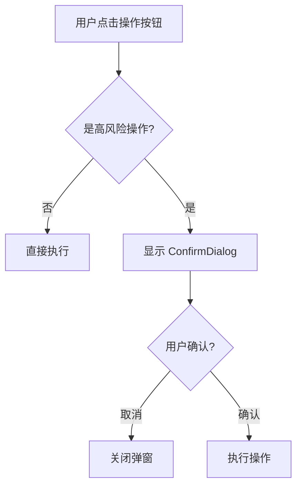

# Plan-02: 账户操作安全网 Implementation Plan (实施计划)

> **For Claude:** REQUIRED SUB-SKILL: Use superpowers:executing-plans to implement this plan task-by-task.

**Goal (目标):** 为高风险账户操作添加确认机制，防止用户误操作导致资产损失。

**Architecture (架构设计):**  
创建通用的 `ConfirmDialog` 组件，为账户重置和平仓操作增加二次确认弹窗。使用 React Portal 渲染弹窗到 body，确保 z-index 层级正确。



**Tech Stack (技术栈):** React 18, TypeScript 5, Tailwind CSS, React Portal

---

## Task 1: 创建 ConfirmDialog 通用组件

**Files:**
- Create: `/Users/duri/githubStudy/RustQuantLab/src/components/common/ConfirmDialog.tsx`

**Step 1: 创建组件文件**

```tsx
import { memo, useEffect, useCallback } from 'react';
import { createPortal } from 'react-dom';

/* ============================================
   Types
   ============================================ */
interface ConfirmDialogProps {
  isOpen: boolean;
  title: string;
  message: string;
  confirmText?: string;
  cancelText?: string;
  variant?: 'danger' | 'warning' | 'normal';
  onConfirm: () => void;
  onCancel: () => void;
}

/* ============================================
   Constants
   ============================================ */
const VARIANT_STYLES = {
  danger: {
    icon: '⚠️',
    confirmBtn: 'bg-red-600 hover:bg-red-700 text-white',
    iconBg: 'bg-red-500/10',
  },
  warning: {
    icon: '⚡',
    confirmBtn: 'bg-yellow-600 hover:bg-yellow-700 text-white',
    iconBg: 'bg-yellow-500/10',
  },
  normal: {
    icon: '❓',
    confirmBtn: 'bg-blue-600 hover:bg-blue-700 text-white',
    iconBg: 'bg-blue-500/10',
  },
} as const;

/* ============================================
   Component
   ============================================ */
function ConfirmDialog({
  isOpen,
  title,
  message,
  confirmText = '确认',
  cancelText = '取消',
  variant = 'normal',
  onConfirm,
  onCancel,
}: ConfirmDialogProps) {
  // ESC 键关闭
  const handleKeyDown = useCallback(
    (e: KeyboardEvent) => {
      if (e.key === 'Escape') onCancel();
    },
    [onCancel]
  );

  useEffect(() => {
    if (isOpen) {
      document.addEventListener('keydown', handleKeyDown);
      document.body.style.overflow = 'hidden';
    }
    return () => {
      document.removeEventListener('keydown', handleKeyDown);
      document.body.style.overflow = '';
    };
  }, [isOpen, handleKeyDown]);

  if (!isOpen) return null;

  const styles = VARIANT_STYLES[variant];

  return createPortal(
    <div 
      className="fixed inset-0 z-50 flex items-center justify-center"
      onClick={onCancel}
    >
      {/* 背景遮罩 */}
      <div className="absolute inset-0 bg-black/60 backdrop-blur-sm" />
      
      {/* 弹窗内容 */}
      <div 
        className="relative bg-gray-900 rounded-xl border border-gray-700 
                   shadow-2xl max-w-md w-full mx-4 p-6 animate-in fade-in zoom-in-95"
        onClick={(e) => e.stopPropagation()}
      >
        {/* 图标 */}
        <div className={`w-12 h-12 ${styles.iconBg} rounded-full 
                        flex items-center justify-center text-2xl mx-auto mb-4`}>
          {styles.icon}
        </div>
        
        {/* 标题 */}
        <h3 className="text-lg font-semibold text-white text-center mb-2">
          {title}
        </h3>
        
        {/* 消息 */}
        <p className="text-sm text-gray-400 text-center mb-6">
          {message}
        </p>
        
        {/* 按钮组 */}
        <div className="flex gap-3">
          <button
            type="button"
            onClick={onCancel}
            className="flex-1 px-4 py-2.5 text-sm font-medium text-gray-300 
                       bg-gray-800 hover:bg-gray-700 rounded-lg transition-colors"
          >
            {cancelText}
          </button>
          <button
            type="button"
            onClick={onConfirm}
            className={`flex-1 px-4 py-2.5 text-sm font-medium rounded-lg 
                        transition-colors ${styles.confirmBtn}`}
          >
            {confirmText}
          </button>
        </div>
      </div>
    </div>,
    document.body
  );
}

export default memo(ConfirmDialog);
```

**Step 2: Verification (Validation)**
- Command: `npm run build`
- Expected: 无编译错误

---

## Task 2: 为账户重置添加确认弹窗

**Files:**
- Modify: `/Users/duri/githubStudy/RustQuantLab/src/App.tsx`
- Import: `/Users/duri/githubStudy/RustQuantLab/src/components/common/ConfirmDialog.tsx`

**Step 1: 添加弹窗状态**

在 App 组件顶部添加：

```tsx
import ConfirmDialog from './components/common/ConfirmDialog';

// 在 App 组件内
const [showResetConfirm, setShowResetConfirm] = useState(false);
```

**Step 2: 包装 resetBalance 函数**

找到 `resetBalance` 调用位置，替换直接调用为弹窗确认：

```tsx
// 原来: onClick={resetBalance}
// 改为:
const handleResetClick = useCallback(() => {
  setShowResetConfirm(true);
}, []);

const handleResetConfirm = useCallback(() => {
  resetBalance();
  setShowResetConfirm(false);
}, [resetBalance]);
```

**Step 3: 渲染确认弹窗**

在 App 组件 return 最后添加：

```tsx
{/* 账户重置确认弹窗 */}
<ConfirmDialog
  isOpen={showResetConfirm}
  title="重置账户余额"
  message="此操作将清空所有持仓和交易历史，余额重置为 10,000 USDT。此操作不可撤销。"
  confirmText="确认重置"
  cancelText="取消"
  variant="danger"
  onConfirm={handleResetConfirm}
  onCancel={() => setShowResetConfirm(false)}
/>
```

**Step 4: Verification (Validation)**
- Command: `npm run build`
- Expected: 无编译错误
- Manual: 点击账户重置按钮，验证弹窗显示并需确认后才执行

---

## Task 3: 为平仓操作添加确认弹窗

**Files:**
- Modify: `/Users/duri/githubStudy/RustQuantLab/src/components/Dashboard/Trade/PositionCard.tsx`
- Import: `/Users/duri/githubStudy/RustQuantLab/src/components/common/ConfirmDialog.tsx`

**Step 1: 添加弹窗状态**

在 `WasmPositionCard` 组件内添加：

```tsx
import ConfirmDialog from '../../common/ConfirmDialog';

// 在组件内
const [showCloseConfirm, setShowCloseConfirm] = useState(false);
```

**Step 2: 包装 onClose 函数**

```tsx
const handleCloseClick = useCallback(() => {
  setShowCloseConfirm(true);
}, []);

const handleCloseConfirm = useCallback(() => {
  onClose?.();
  setShowCloseConfirm(false);
}, [onClose]);
```

**Step 3: 更新按钮点击事件**

找到 Close 按钮，将 `onClick={onClose}` 改为 `onClick={handleCloseClick}`

**Step 4: 渲染确认弹窗**

在组件 return 最后添加：

```tsx
{/* 平仓确认弹窗 */}
<ConfirmDialog
  isOpen={showCloseConfirm}
  title="确认平仓"
  message={`即将以市价平仓 ${position.side === 'LONG' ? 'Long' : 'Short'} ${position.size} ${symbol}，预计${
    (position.unrealizedPnl ?? 0) >= 0 ? '盈利' : '亏损'
  } ${Math.abs(position.unrealizedPnl ?? 0).toFixed(2)} USDT`}
  confirmText="确认平仓"
  cancelText="取消"
  variant={(position.unrealizedPnl ?? 0) >= 0 ? 'normal' : 'warning'}
  onConfirm={handleCloseConfirm}
  onCancel={() => setShowCloseConfirm(false)}
/>
```

**Step 5: Verification (Validation)**
- Command: `npm run build`
- Expected: 无编译错误
- Manual: 有持仓时点击 Close 按钮，验证弹窗显示并包含仓位信息

---

## Task 4: 创建 common 组件导出入口

**Files:**
- Create: `/Users/duri/githubStudy/RustQuantLab/src/components/common/index.ts`

**Step 1: 创建导出文件**

```tsx
export { default as ConfirmDialog } from './ConfirmDialog';
```

**Step 2: Verification (Validation)**
- Command: `npm run build`
- Expected: 无编译错误

---

## 验证清单

| 任务 | 验证方式 | 预期结果 |
|------|----------|----------|
| Task 1 | 编译通过 | ConfirmDialog 组件创建成功 |
| Task 2 | 点击账户重置按钮 | 显示危险确认弹窗，需确认后才重置 |
| Task 3 | 点击平仓按钮 | 显示确认弹窗，包含仓位盈亏预览 |
| Task 4 | 编译通过 | common 组件导出正常 |

---

> 📌 完成后更新 [README.md](./README.md) 中 Plan-02 状态为 ✅
