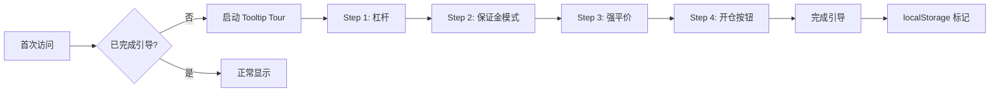

# Plan-05: 新手引导流程 Implementation Plan (实施计划)

> **For Claude:** REQUIRED SUB-SKILL: Use superpowers:executing-plans to implement this plan task-by-task.

**Goal (目标):** 为首次访问用户提供交互式引导流程，解释核心交易概念（杠杆、保证金模式、强平价），降低学习曲线。

**Architecture (架构设计):**  
使用轻量级 Tooltip Tour 组件实现 3-5 步引导流程。通过 localStorage 记录引导完成状态，仅首次访问触发。关键概念添加 "?" 图标 Tooltip 供随时查看。



**Tech Stack (技术栈):** React 18, TypeScript 5, Tailwind CSS, localStorage

---

## Task 1: 创建 Tooltip 组件

**Files:**
- Create: `/Users/duri/githubStudy/RustQuantLab/src/components/common/Tooltip.tsx`

**Step 1: 创建基础 Tooltip**

```tsx
import { memo, useState, useRef, useEffect } from 'react';
import { createPortal } from 'react-dom';

interface TooltipProps {
  content: React.ReactNode;
  children: React.ReactNode;
  position?: 'top' | 'bottom' | 'left' | 'right';
  delay?: number;
}

function Tooltip({ 
  content, 
  children, 
  position = 'top',
  delay = 200 
}: TooltipProps) {
  const [isVisible, setIsVisible] = useState(false);
  const [coords, setCoords] = useState({ x: 0, y: 0 });
  const triggerRef = useRef<HTMLDivElement>(null);
  const timeoutRef = useRef<number>();

  const updatePosition = () => {
    if (!triggerRef.current) return;
    const rect = triggerRef.current.getBoundingClientRect();
    const padding = 8;

    let x = rect.left + rect.width / 2;
    let y = rect.top;

    switch (position) {
      case 'bottom':
        y = rect.bottom + padding;
        break;
      case 'left':
        x = rect.left - padding;
        y = rect.top + rect.height / 2;
        break;
      case 'right':
        x = rect.right + padding;
        y = rect.top + rect.height / 2;
        break;
      default: // top
        y = rect.top - padding;
    }

    setCoords({ x, y });
  };

  const handleMouseEnter = () => {
    timeoutRef.current = window.setTimeout(() => {
      updatePosition();
      setIsVisible(true);
    }, delay);
  };

  const handleMouseLeave = () => {
    clearTimeout(timeoutRef.current);
    setIsVisible(false);
  };

  useEffect(() => {
    return () => clearTimeout(timeoutRef.current);
  }, []);

  return (
    <>
      <div 
        ref={triggerRef}
        onMouseEnter={handleMouseEnter}
        onMouseLeave={handleMouseLeave}
        className="inline-flex"
      >
        {children}
      </div>
      {isVisible && createPortal(
        <div
          className="fixed z-50 px-3 py-2 text-sm text-white bg-gray-800 
                     rounded-lg shadow-lg max-w-xs animate-in fade-in zoom-in-95"
          style={{
            left: coords.x,
            top: coords.y,
            transform: position === 'top' ? 'translate(-50%, -100%)' :
                       position === 'bottom' ? 'translate(-50%, 0)' :
                       position === 'left' ? 'translate(-100%, -50%)' :
                       'translate(0, -50%)',
          }}
        >
          {content}
        </div>,
        document.body
      )}
    </>
  );
}

export default memo(Tooltip);
```

**Step 2: Verification (Validation)**
- Command: `npm run build`
- Expected: 无编译错误

---

## Task 2: 创建 HelpIcon 组件

**Files:**
- Create: `/Users/duri/githubStudy/RustQuantLab/src/components/common/HelpIcon.tsx`

**Step 1: 创建带 Tooltip 的帮助图标**

```tsx
import { memo } from 'react';
import Tooltip from './Tooltip';

interface HelpIconProps {
  content: React.ReactNode;
  position?: 'top' | 'bottom' | 'left' | 'right';
}

/**
 * HelpIcon - 带 Tooltip 的帮助图标
 * 
 * 用于在关键术语旁显示 "?" 图标，hover 时展示解释
 */
function HelpIcon({ content, position = 'top' }: HelpIconProps) {
  return (
    <Tooltip content={content} position={position}>
      <span className="inline-flex items-center justify-center w-4 h-4 ml-1 
                       text-xs text-gray-500 hover:text-gray-400 cursor-help
                       rounded-full border border-gray-700 hover:border-gray-600
                       transition-colors">
        ?
      </span>
    </Tooltip>
  );
}

export default memo(HelpIcon);
```

**Step 2: 更新 common 组件导出**

在 `/Users/duri/githubStudy/RustQuantLab/src/components/common/index.ts` 添加：

```tsx
export { default as Tooltip } from './Tooltip';
export { default as HelpIcon } from './HelpIcon';
```

**Step 3: Verification (Validation)**
- Command: `npm run build`
- Expected: 无编译错误

---

## Task 3: 创建 OnboardingTour 组件

**Files:**
- Create: `/Users/duri/githubStudy/RustQuantLab/src/components/Onboarding/OnboardingTour.tsx`

**Step 1: 定义引导步骤**

```tsx
import { memo, useState, useEffect, useCallback } from 'react';
import { createPortal } from 'react-dom';

/* ============================================
   Constants
   ============================================ */
const ONBOARDING_KEY = 'rustquantlab_onboarding_complete';

interface TourStep {
  target: string; // CSS selector
  title: string;
  content: string;
  position: 'top' | 'bottom' | 'left' | 'right';
}

const TOUR_STEPS: TourStep[] = [
  {
    target: '[data-tour="leverage"]',
    title: '杠杆 (Leverage)',
    content: '杠杆放大您的交易规模。10x 杠杆意味着用 100 USDT 保证金可以开 1000 USDT 的仓位。高杠杆 = 高风险 = 高收益/亏损。',
    position: 'bottom',
  },
  {
    target: '[data-tour="margin-mode"]',
    title: '保证金模式',
    content: '全仓模式：所有仓位共享保证金，一个爆仓可能影响全部。逐仓模式：每个仓位独立保证金，风险隔离。',
    position: 'bottom',
  },
  {
    target: '[data-tour="liq-price"]',
    title: '强平价 (Liquidation)',
    content: '当价格触及强平价时，系统自动平仓以防止亏损超过保证金。距离强平价越近 = 风险越高。',
    position: 'left',
  },
  {
    target: '[data-tour="open-position"]',
    title: '开仓交易',
    content: '做多 (Long)：预期价格上涨获利。做空 (Short)：预期价格下跌获利。准备好开始模拟交易了吗？',
    position: 'top',
  },
];

/* ============================================
   Component
   ============================================ */
interface OnboardingTourProps {
  onComplete?: () => void;
}

function OnboardingTour({ onComplete }: OnboardingTourProps) {
  const [currentStep, setCurrentStep] = useState(0);
  const [isActive, setIsActive] = useState(false);
  const [highlight, setHighlight] = useState<DOMRect | null>(null);

  // 检查是否需要显示引导
  useEffect(() => {
    const completed = localStorage.getItem(ONBOARDING_KEY);
    if (!completed) {
      // 延迟启动，等待 DOM 渲染
      setTimeout(() => setIsActive(true), 1000);
    }
  }, []);

  // 更新高亮位置
  useEffect(() => {
    if (!isActive) return;
    
    const step = TOUR_STEPS[currentStep];
    const element = document.querySelector(step.target);
    
    if (element) {
      const rect = element.getBoundingClientRect();
      setHighlight(rect);
    }
  }, [currentStep, isActive]);

  const handleNext = useCallback(() => {
    if (currentStep < TOUR_STEPS.length - 1) {
      setCurrentStep((s) => s + 1);
    } else {
      // 完成引导
      localStorage.setItem(ONBOARDING_KEY, 'true');
      setIsActive(false);
      onComplete?.();
    }
  }, [currentStep, onComplete]);

  const handleSkip = useCallback(() => {
    localStorage.setItem(ONBOARDING_KEY, 'true');
    setIsActive(false);
    onComplete?.();
  }, [onComplete]);

  if (!isActive) return null;

  const step = TOUR_STEPS[currentStep];

  return createPortal(
    <div className="fixed inset-0 z-50">
      {/* 遮罩层 */}
      <div 
        className="absolute inset-0 bg-black/70"
        onClick={handleSkip}
      />
      
      {/* 高亮区域 (镂空) */}
      {highlight && (
        <div
          className="absolute bg-transparent border-2 border-yellow-400 rounded-lg
                     shadow-[0_0_0_9999px_rgba(0,0,0,0.7)]"
          style={{
            left: highlight.left - 4,
            top: highlight.top - 4,
            width: highlight.width + 8,
            height: highlight.height + 8,
          }}
        />
      )}
      
      {/* Tooltip 内容 */}
      {highlight && (
        <div
          className="absolute bg-gray-900 rounded-xl border border-gray-700 
                     shadow-2xl p-4 max-w-sm animate-in fade-in zoom-in-95"
          style={{
            left: step.position === 'left' 
              ? highlight.left - 320 
              : step.position === 'right'
              ? highlight.right + 16
              : highlight.left,
            top: step.position === 'top'
              ? highlight.top - 180
              : step.position === 'bottom'
              ? highlight.bottom + 16
              : highlight.top,
          }}
        >
          {/* 步骤指示 */}
          <div className="text-xs text-gray-500 mb-2">
            步骤 {currentStep + 1} / {TOUR_STEPS.length}
          </div>
          
          {/* 标题 */}
          <h4 className="text-lg font-semibold text-white mb-2">
            {step.title}
          </h4>
          
          {/* 内容 */}
          <p className="text-sm text-gray-400 mb-4">
            {step.content}
          </p>
          
          {/* 按钮组 */}
          <div className="flex justify-between">
            <button
              onClick={handleSkip}
              className="text-sm text-gray-500 hover:text-gray-400"
            >
              跳过引导
            </button>
            <button
              onClick={handleNext}
              className="px-4 py-2 text-sm font-medium text-black 
                         bg-yellow-400 hover:bg-yellow-300 rounded-lg"
            >
              {currentStep < TOUR_STEPS.length - 1 ? '下一步' : '开始交易'}
            </button>
          </div>
        </div>
      )}
    </div>,
    document.body
  );
}

export default memo(OnboardingTour);
```

**Step 2: Verification (Validation)**
- Command: `npm run build`
- Expected: 无编译错误

---

## Task 4: 添加 data-tour 属性到目标元素

**Files:**
- Modify: `/Users/duri/githubStudy/RustQuantLab/src/components/Dashboard/Trade/TradePanel.tsx`
- Modify: `/Users/duri/githubStudy/RustQuantLab/src/components/Dashboard/Trade/PositionCard.tsx`

**Step 1: 杠杆滑块添加 data-tour**

在 `LeverageSlider` 容器添加：

```tsx
<div data-tour="leverage" className="...">
  <LeverageSlider ... />
</div>
```

**Step 2: 保证金模式选择器添加 data-tour**

```tsx
<div data-tour="margin-mode" className="...">
  {/* Cross / Isolated 选择器 */}
</div>
```

**Step 3: 强平价显示添加 data-tour**

在 `PositionCard` 中强平价区域：

```tsx
<div data-tour="liq-price" className="...">
  强平价: {liquidationPrice}
</div>
```

**Step 4: 开仓按钮添加 data-tour**

```tsx
<div data-tour="open-position" className="...">
  <button>做多</button>
  <button>做空</button>
</div>
```

**Step 5: Verification (Validation)**
- Command: `npm run build`
- Expected: 无编译错误

---

## Task 5: 在 App 中集成 OnboardingTour

**Files:**
- Modify: `/Users/duri/githubStudy/RustQuantLab/src/App.tsx`

**Step 1: 导入组件**

```tsx
import OnboardingTour from './components/Onboarding/OnboardingTour';
```

**Step 2: 渲染 OnboardingTour**

在 App 组件 return 最后添加：

```tsx
{/* 新手引导 */}
{dataSource === 'mock' && <OnboardingTour />}
```

**Step 3: Verification (Validation)**
- Command: `npm run build`
- Expected: 无编译错误
- Manual: 清除 localStorage，刷新页面验证引导流程启动

---

## Task 6: 添加关键术语的 HelpIcon

**Files:**
- Modify: `/Users/duri/githubStudy/RustQuantLab/src/components/Dashboard/Trade/TradePanel.tsx`

**Step 1: 导入 HelpIcon**

```tsx
import { HelpIcon } from '../../common';
```

**Step 2: 在关键位置添加 HelpIcon**

```tsx
{/* 杠杆标签 */}
<label className="flex items-center text-xs text-gray-400">
  杠杆
  <HelpIcon content="杠杆放大交易规模，10x = 10 倍收益/亏损" />
</label>

{/* 保证金模式标签 */}
<label className="flex items-center text-xs text-gray-400">
  保证金模式
  <HelpIcon content="全仓：共享保证金 | 逐仓：独立保证金，风险隔离" />
</label>
```

**Step 3: Verification (Validation)**
- Command: `npm run build`
- Expected: 无编译错误
- Manual: Hover 帮助图标，验证 Tooltip 显示正确内容

---

## 验证清单

| 任务 | 验证方式 | 预期结果 |
|------|----------|----------|
| Task 1 | 编译通过 | Tooltip 组件创建成功 |
| Task 2 | 编译通过 | HelpIcon 组件创建成功 |
| Task 3 | 编译通过 | OnboardingTour 组件创建成功 |
| Task 4 | 编译通过 | data-tour 属性已添加 |
| Task 5 | 清空 localStorage 后刷新 | 引导流程自动启动，4 步完成 |
| Task 6 | Hover 帮助图标 | Tooltip 显示术语解释 |

---

## 测试场景

1. **首次访问**: 清空 localStorage，刷新页面，引导自动启动
2. **跳过引导**: 点击"跳过引导"，关闭弹窗，不再显示
3. **完成引导**: 逐步完成 4 步引导，不再显示
4. **再次访问**: 刷新页面，引导不再显示
5. **HelpIcon**: 随时 hover 帮助图标查看解释

---

> 📌 完成后更新 [README.md](./README.md) 中 Plan-05 状态为 ✅
